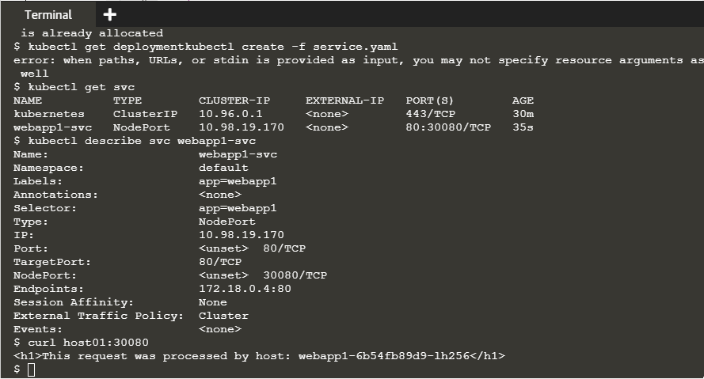

# Deploy Containers Using YAML

Một trong những Kubernetes objects phổ biến nhất là deployment object. 
Deployment object xác định thông số kỹ thuật cho containers cùng với name và label được các phần khác của Kubernetes sử dụng để expose và connect với ứng dụng.

## Step 1 - Create Deployment
Cấu trúc của app như dưới đây:


Trong đó File cấu hình deployment.yaml xác định cách khởi chạy ứng dụng có tên webapp1 bằng Docker Image katacoda/docker-http-server chạy trên Port 80.

```
apiVersion: apps/v1
kind: Deployment
metadata:
  name: webapp1
spec:
  replicas: 1
  selector:
    matchLabels:
      app: webapp1
  template:
    metadata:
      labels:
        app: webapp1
    spec:
      containers:
      - name: webapp1
        image: katacoda/docker-http-server:latest
        ports:
        - containerPort: 80
```

Để deploy cluster bằng file deployment.yaml, ta dùng lệnh:  `kubectl create -f deployment.yaml`

Vì đây là một Deployment object nên ta có thể hiển thị nó trên danh sách các deployment: `kubectl get deployment`

và sử dụng câu lệnh `kubectl describe deployment webapp1` để describle nó. Kết quả như sau:


## Step 2 - Create Service
Kubernetes có khả năng kết nối network mạnh mẽ giúp kiểm soát sự giao tiếp với nhau giữa các ứng dụng. Các cấu hình network này cũng có thể được định nghĩa thông qua YAML.
File cấu hình service.yaml chọn tất cả các ứng dụng có label webapp1. Khi nhiều replicas hoặc instance được deployed, chúng sẽ được cân bằng tải tự động dựa trên label chung này. 
service này còn cung cấp ứng dụng thông qua NodePort.

```
apiVersion: v1
kind: Service
metadata:
  name: webapp1-svc
  labels:
    app: webapp1
spec:
  type: NodePort
  ports:
  - port: 80
    nodePort: 30080
  selector:
    app: webapp1
```
Ta deploy Service này bằng câu lệnh: `kubectl create -f service.yaml`

Tương tự như step01, ta có thể xem danh sách các objects Service với `kubectl get svc` và expose thêm chi tiết về cấu hình `kubectl describe svc webapp1-svc`. Ta cũng có thể ping tới địa chỉ `host01:300080` để kiểm tra. Kết quả như sau



## Step 3 - Scale Deployment

Nội dung của file cấu hình YAML có thể được thay đổi vì ta cần có các cấu hình khác nhau để deployment. Điều này tuân theo một `infrastructure as code mindset`. 
Các manifests phải được giữ dưới sự kiểm soát nguồn và được sử dụng để đảm bảo rằng cấu hình trong quá trình sản xuất phù hợp với cấu hình trong kiểm soát nguồn.

Để Scale Depolyment, ta cập nhật tệp deployment.yaml mục manifests với `replicas: 4` để tăng số lượng replicas đang chạy.
Sau khi cập nhật, ta chỉ cần deloy lại file deployment.yaml theo các bước ở step01: `kubectl apply -f deployment.yaml`.
Câu lệnh `kubectl get deployment` và `kubectl get pods` để xem danh sách các deployments và các pods như bên dưới.
Vì tất cả các Pods đều có cùng một label nên chúng sẽ được cân bằng tải sau Service NodePort được triển khai.

