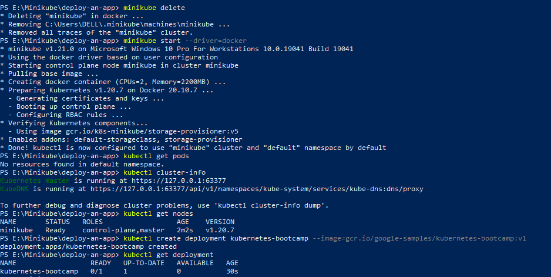
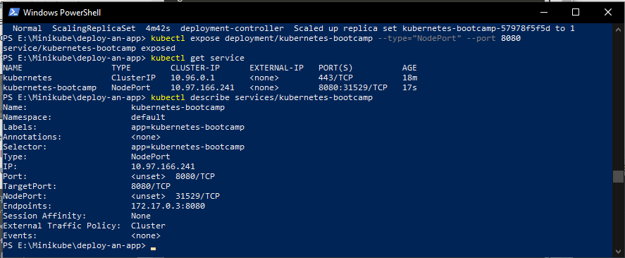
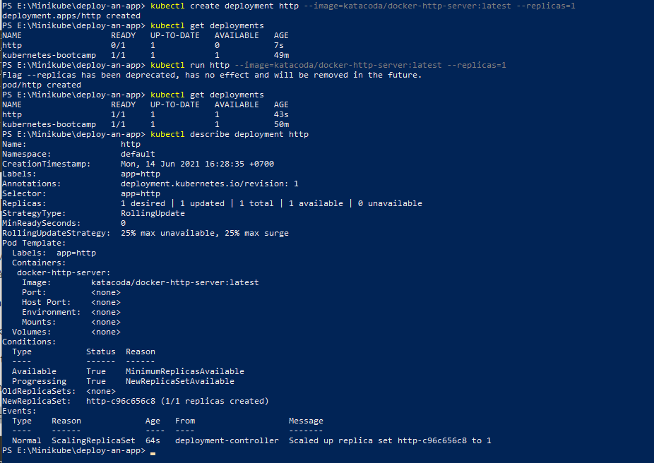
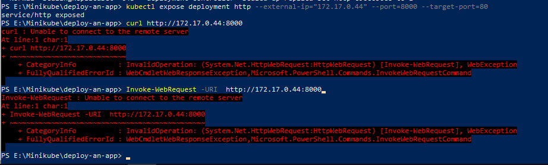

# Deploy an app

# Deploy using kubectl
Bước đầu tiên chúng ta cần khởi chạy một Kubernetes cluster.

Thực hiện lệnh dưới đây để khởi động các thành phần Cluster và tải xuống Kubectl CLI.

minikube start --wait=false

Kiểm tra các Nodes có Ready chưa bằng `kubectl get nodes`

Tạo một Deployment kubernetes-bootcamp

`kubectl create deployment kubernetes-bootcamp --image=gcr.io/google-samples/kubernetes-bootcamp:v1`

Expose deployment kubernetes-bootcamp kubernetes-bootcamp

`kubectl expose deployment/kubernetes-bootcamp --type="NodePort" --port 8080`

`kubectl describe services/kubernetes-bootcamp`

Tạo một deployment mới : http theo các bước của ..., kết quả là:

Thử ping thì bị lỗi ntn:

# Deploy using YAML