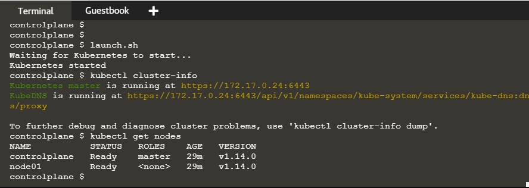
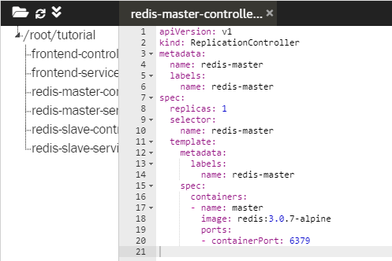
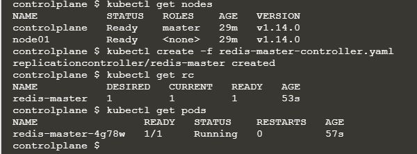
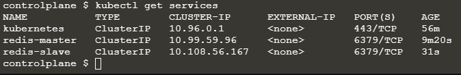
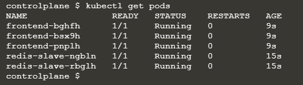
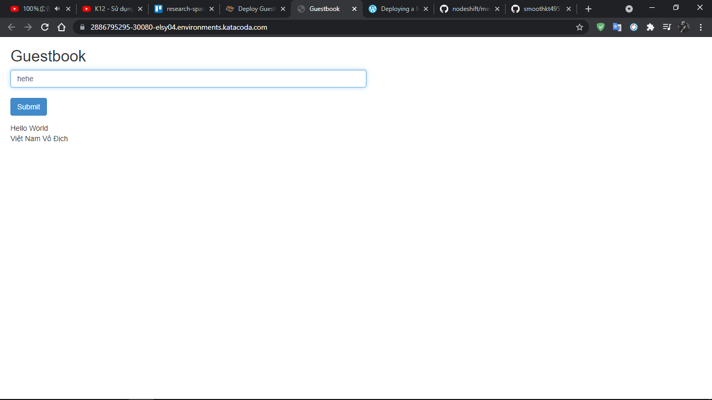

# Deploy Guestbook example on Kubernetes
Bài tập này demo cho cách khởi chạy một ứng dụng web đa tầng, đơn giản bằng Kubernetes và Docker.
Ứng dụng Guestbook này lưu trữ các ghi chú từ khách trong Redis thông qua các lệnh gọi API JavaScript. Redis chứa một master (để lưu trữ) và một tập hợp các redis slaves được sao chép.

## Step 1 - Start Kubernetes

Để bắt đầu, chúng ta cần một Kubernetes Cluster đang chạy. Chi tiết về điều này được giải thích trong kịch bản cụm Launch Kubernetes.

Bắt đầu một  single-node cluster bằng cách sử dụng các helper script. Tập lệnh helper script sẽ khởi chạy phát hiện API, Master, Proxy và DNS. 
Ứng dụng Web sử dụng DNS Discovery để tìm Redis slave để lưu trữ dữ liệu.

`launch.sh`



Kiểm tra mọi thứ đã hoạt động bằng cách sử dụng Kiểm tra tình trạng sau: kubectl cluster-info kubectl nhận các nút Nếu nút trả về NotReady thì nó vẫn đang đợi. Chờ vài giây trước khi thử lại.

## Step 2 - Redis Master Controller

Giai đoạn đầu tiên của việc khởi chạy ứng dụng là khởi động Redis Master. Việc triển khai dịch vụ Kubernetes có ít nhất hai phần. Một là replication controller và một service.

Replication controller xác định có bao nhiêu phiên bản sẽ được chạy, Docker Image để sử dụng và tên để xác định Service. 
Các tùy chọn bổ sung khác có thể được sử dụng để configuration and discovery. 


Nếu Redis không hoạt động, bộ điều khiển sao chép sẽ khởi động lại nó trên một nút đang hoạt động.

Trong ví dụ này, YAML xác định một máy chủ redis được gọi là redis-master bằng cách sử dụng cổng 6379 chính thức đang chạy redis. Lệnh tạo kubectl nhận định nghĩa YAML và hướng dẫn trình điều khiển khởi động Controller.
`kubectl create -f redis-master-controller.yaml`



```
apiVersion: v1
kind: ReplicationController
metadata:
  name: redis-master
  labels:
    name: redis-master
spec:
  replicas: 1
  selector:
    name: redis-master
  template:
    metadata:
      labels:
        name: redis-master
    spec:
      containers:
      - name: master
        image: redis:3.0.7-alpine
        ports:
        - containerPort: 6379
```

Có thể xem điều này bằng cách sử dụng kubectl, `kubectl get nodes` và `kubectl get pods` kết quả như sau:




## Step 3 - Redis Master Service

Phần thứ hai là một Service. Một Kubernetes Service là một bộ cân bằng tải được đặt tên ủy nhiệm lưu lượng truy cập đến một hoặc nhiều Container. Proxy hoạt động ngay cả khi các Container nằm trên các Node khác nhau.

Service Proxy giao tiếp trong Cluster và hiếm khi để lộ các Ports ra giao diện bên ngoài.

Thông thường khi khởi chạy một Service ta sẽ không thể kết nối bằng curl hoặc netcat nếu ta không khởi động nó như một phần của Kubernetes.
Cách tiếp cận được khuyến nghị là có một LoadBalancer service để xử lý các giao tiếp bên ngoài.

`kubectl create -f redis-master-service.yaml`
YAML xác định tên của replication controller, redis-master và các ports cần được ủy quyền:

```
apiVersion: v1
kind: Service
metadata:
  name: redis-master
  labels:
    name: redis-master
spec:
  ports:
    # the port that this service should serve on
  - port: 6379
    targetPort: 6379
  selector:
    name: redis-master
```

Sử dụng `kubectl get services` và `kubectl describe services redis-master` để xem list và describle Services:


## Step 4 - Replication Slave Pods

Trong trường hợp này, chúng ta sẽ khởi chạy hai phiên bản của Pods bằng cách sử dụng image `kubernetes/redis-slave:v2`. Nó sẽ liên kết đến redis-master thông qua DNS bằng cách chạy câu lệnh sau: 
`kubectl create -f redis-slave-controller.yaml` Nội dung file redis-slave-controller.yaml:

```
apiVersion: v1
kind: ReplicationController
metadata:
  name: redis-slave
  labels:
    name: redis-slave
spec:
  replicas: 2
  selector:
    name: redis-slave
  template:
    metadata:
      labels:
        name: redis-slave
    spec:
      containers:
      - name: worker
        image: gcr.io/google_samples/gb-redisslave:v1
        env:
        - name: GET_HOSTS_FROM
          value: dns
          # If your cluster config does not include a dns service, then to
          # instead access an environment variable to find the master
          # service's host, comment out the 'value: dns' line above, and
          # uncomment the line below.
          # value: env
        ports:
        - containerPort: 6379
```

## Step 5 - Redis Slave Service

Như trước đây, chúng ta cần làm cho các Redis slaves của mình có thể truy cập được các request được gửi đến. Điều này được thực hiện bằng cách khởi động một Service biết cách giao tiếp với redis-slave.

Vì ta đang có hai Pod được replicated nên Service cũng sẽ cung cấp cân bằng tải giữa hai Node. Đây là nội dung file `redis-slave-service.yaml` thông qua câu lệnh `kubectl create -f redis-slave-service.yaml`:

```
apiVersion: v1
kind: Service
metadata:
  name: redis-slave
  labels:
    name: redis-slave
spec:
  ports:
    # the port that this service should serve on
  - port: 6379
  selector:
    name: redis-slave
```
Đến đây ta đang có 3 services đang chạy như sau:




## Step 6 - Frontend Replicated Pods

YAML xác định một service được gọi là frontend sử dụng Image _gcr.io/googlesamples/gb-frontend:v3. Replication controller sẽ đảm bảo rằng ba Pod sẽ luôn tồn tại.

```
apiVersion: v1
kind: ReplicationController
metadata:
  name: frontend
  labels:
    name: frontend
spec:
  replicas: 3
  selector:
    name: frontend
  template:
    metadata:
      labels:
        name: frontend
    spec:
      containers:
      - name: php-redis
        image: gcr.io/google_samples/gb-frontend:v3
        env:
        - name: GET_HOSTS_FROM
          value: dns
          # If your cluster config does not include a dns service, then to
          # instead access environment variables to find service host
          # info, comment out the 'value: dns' line above, and uncomment the
          # line below.
          # value: env
        ports:
        - containerPort: 80
```


## Step 7 - Guestbook Frontend Service

YAML định nghĩa Service là một NodePort. NodePort cho phép bạn thiết lập các cổng nổi tiếng được chia sẻ trên toàn bộ Cluster của bạn.

Trong trường hợp này, chúng tôi xác định ứng dụng web của chúng tôi đang chạy trên cổng 80 nhưng chúng tôi sẽ hiển thị dịch vụ trên 30080.
`kubectl create -f frontend-service.yaml`


```
apiVersion: v1
kind: Service
metadata:
  name: frontend
  labels:
    name: frontend
spec:
  # if your cluster supports it, uncomment the following to automatically create
  # an external load-balanced IP for the frontend service.
  # type: LoadBalancer
  type: NodePort
  ports:
    # the port that this service should serve on
    - port: 80
      nodePort: 30080
  selector:
    name: frontend
```

## Step 8 - Access Guestbook Frontend

Với tất cả các Controller và Service được định nghĩa ở trên, Kubernetes sẽ bắt đầu khởi chạy chúng dưới dạng Pod.
Một Pod có thể có các trạng thái khác nhau tùy thuộc vào những gì đang xảy ra.

Để xem trạng thái của các Pods ta dùng câu lệnh `kubectl get pods`:



Khi Pod ở trạng thái Running, bạn sẽ có thể xem Ui của Web GéutBook qua Port 30080. Sử dụng URL để xem trang `https://2886795295-30080-elsy04.enosystem.katacoda.com`

Một PHP service đang discovery các phiên bản Redis thông qua DNS. Bây giờ bạn có một ứng dụng đa tầng đang hoạt động được triển khai trên Kubernetes.



