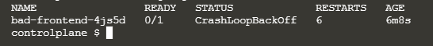
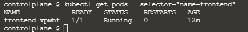
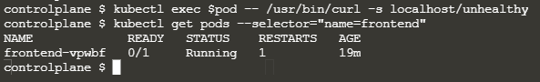

# Liveness and Readiness Healthchecks
https://kubernetes.io/docs/tasks/configure-pod-container/configure-liveness-readiness-startup-probes/
## Step 1 - Launch Cluster
Tương tự nhưu các bài lab trước đây, để bắt đầu chúng ta cần khởi chạy một Kubernetes Cluster. 
Thực hiện lệnh dưới đây để khởi động các thành phần Cluster và tải xuống Kubectl CLI:
`launch.sh`, sau khi Cluster khởi động xong ta triển khai ứng dụng demo với `kubectl apply -f deploy.yaml`

## Step 2 - Readiness Probe
Bạn có thể xem trạng thái của deployment với `cat deploy.yaml`
```
kind: List
apiVersion: v1
items:
- kind: ReplicationController
  apiVersion: v1
  metadata:
    name: frontend
    labels:
      name: frontend
  spec:
    replicas: 1
    selector:
      name: frontend
    template:
      metadata:
        labels:
          name: frontend
      spec:
        containers:
        - name: frontend
          image: katacoda/docker-http-server:health
          readinessProbe:
            httpGet:
              path: /
              port: 80
            initialDelaySeconds: 1
            timeoutSeconds: 1
          livenessProbe:
            httpGet:
              path: /
              port: 80
            initialDelaySeconds: 1
            timeoutSeconds: 1
- kind: ReplicationController
  apiVersion: v1
  metadata:
    name: bad-frontend
    labels:
      name: bad-frontend
  spec:
    replicas: 1
    selector:
      name: bad-frontend
    template:
      metadata:
        labels:
          name: bad-frontend
      spec:
        containers:
        - name: bad-frontend
          image: katacoda/docker-http-server:unhealthy
          readinessProbe:
            httpGet:
              path: /
              port: 80
            initialDelaySeconds: 1
            timeoutSeconds: 1
          livenessProbe:
            httpGet:
              path: /
              port: 80
            initialDelaySeconds: 1
            timeoutSeconds: 1
- kind: Service
  apiVersion: v1
  metadata:
    labels:
      app: frontend
      kubernetes.io/cluster-service: "true"
    name: frontend
  spec:
    type: NodePort
    ports:
    - port: 80
      nodePort: 30080
    selector:
      app: frontend
```

Khi triển khai Replication Controller, mỗi Pod có một `Readiness and Liveness check`. Mỗi lần check sẽ có định dạng sau để thực hiện kiểm tra sức Readiness và Liveness qua HTTP.

```
livenessProbe:
  httpGet:
    path: /
    port: 80
  initialDelaySeconds: 1
  timeoutSeconds: 1
```

Pod đầu tiên trong Replication Controller là bad-frontend, nó là một HTTP service luôn trả về lỗi 500 thông báo lỗi khi nó chưa khởi động chính xác. 
Cụ thể hơn ta có thể xem trạng thái của Pod bad-frontend với lệnh: `kubectl get pods --selector="name=bad-frontend"`, kết quả như sau:



Kubectl sẽ trả lại các Pods được deploy thông qua nhãn cụ thể. Bởi vì check Readiness và Liveness không thành công, nó thông báo rằng không có Container nào đang Ready và cũng sẽ cho biết số lần khởi động lại Containers.

Để tìm hiểu thêm chi tiết về lý do tại sao nó không thành công, ta có thể describle Pod bằng câu lệnh `pod=$(kubectl get pods --selector="name=bad-frontend" --output=jsonpath={.items..metadata.name})
kubectl describe pod $pod`

```
Name:               bad-frontend-4js5d
Namespace:          default
Priority:           0
PriorityClassName:  <none>
Node:               controlplane/172.17.0.51
Start Time:         Thu, 10 Jun 2021 09:42:06 +0000
Labels:             name=bad-frontend
Annotations:        <none>
Status:             Running
IP:                 10.32.0.6
Controlled By:      ReplicationController/bad-frontend
Containers:
  bad-frontend:
    Container ID:   docker://dd7ac3f328188063cc050985acfb7bd3cf2e9cc50b76161e0c3336cfec0ca9ad
    Image:          katacoda/docker-http-server:unhealthy
    Image ID:       docker-pullable://katacoda/docker-http-server@sha256:bea95c69c299c690103c39ebb3159c39c5061fee1dad13aa1b0625e0c6b52f22
    Port:           <none>
    Host Port:      <none>
    State:          Waiting
      Reason:       CrashLoopBackOff
    Last State:     Terminated
      Reason:       Error
      Exit Code:    2
      Started:      Thu, 10 Jun 2021 09:49:18 +0000
      Finished:     Thu, 10 Jun 2021 09:49:40 +0000
    Ready:          False
    Restart Count:  7
    Liveness:       http-get http://:80/ delay=1s timeout=1s period=10s #success=1 #failure=3
    Readiness:      http-get http://:80/ delay=1s timeout=1s period=10s #success=1 #failure=3
    Environment:    <none>
    Mounts:
      /var/run/secrets/kubernetes.io/serviceaccount from default-token-2lkf7 (ro)
Conditions:
  Type              Status
  Initialized       True 
  Ready             False 
  ContainersReady   False 
  PodScheduled      True 
Volumes:
  default-token-2lkf7:
    Type:        Secret (a volume populated by a Secret)
    SecretName:  default-token-2lkf7
    Optional:    false
QoS Class:       BestEffort
Node-Selectors:  <none>
Tolerations:     node.kubernetes.io/not-ready:NoExecute for 300s
                 node.kubernetes.io/unreachable:NoExecute for 300s
Events:
  Type     Reason     Age                    From                   Message
  ----     ------     ----                   ----                   -------
  Normal   Scheduled  10m                    default-scheduler      Successfully assigned default/bad-frontend-4js5d to controlplane
  Normal   Pulling    10m                    kubelet, controlplane  Pulling image "katacoda/docker-http-server:unhealthy"
  Normal   Pulled     10m                    kubelet, controlplane  Successfully pulled image "katacoda/docker-http-server:unhealthy"
  Normal   Created    9m27s (x3 over 10m)    kubelet, controlplane  Created container bad-frontend
  Normal   Started    9m27s (x3 over 10m)    kubelet, controlplane  Started container bad-frontend
  Normal   Killing    9m27s (x2 over 9m57s)  kubelet, controlplane  Container bad-frontend failed liveness probe, will be restarted
  Normal   Pulled     9m27s (x2 over 9m57s)  kubelet, controlplane  Container image "katacoda/docker-http-server:unhealthy" already present on machine
  Warning  Unhealthy  9m17s (x5 over 10m)    kubelet, controlplane  Readiness probe failed: HTTP probe failed with statuscode: 500
  Warning  Unhealthy  9m7s (x8 over 10m)     kubelet, controlplane  Liveness probe failed: HTTP probe failed with statuscode: 500
  Warning  BackOff    24s (x33 over 7m57s)   kubelet, controlplane  Back-off restarting failed container
```

Trên đây là trạng thái của Pod bad-frontend, trong khi đó Pod thứ hai là frontend trả về trạng thái OK khi khởi chạy



## Step 3 - Liveness Probe
Trong bài tập này, một HTTP server sẽ có một endpoint bổ sung trả về lỗi 500. Sử dụng kubectl execute ta có thể gọi đến endpoint đó qua câu lệnh:
`pod=$(kubectl get pods --selector="name=frontend" --output=jsonpath={.items..metadata.name})
kubectl exec $pod -- /usr/bin/curl -s localhost/unhealthy`

Dựa trên cấu hình ở trên, Kubernetes sẽ thực hiện Liveness Probe. Nếu Probe không thành công, Kubernetes sẽ phá hủy và tạo lại Container bị lỗi. 
Việc ta thực thi câu lệnh bên trên để làm sập service và Kubernetes sẽ tự động khôi phục nó. Để kiểm tra xem Pod có bị mất đi không, ta dùng lệnh `` và kết quả như sau:

