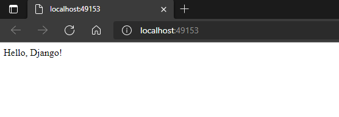
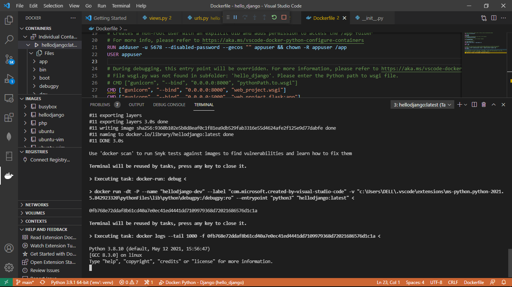

# Các bước thực hiện
1. Create a project environment for the Django
2. Create the Django project
3. Create a Django app
4. Create a debugger launch profile
5. Explore the debugger
6. Add Docker files to the project
7. Add an environment variable to the image
8. Build, run, and debug the container
9. Use the Docker Explorer

Dựa trên hướng dẫn của: [Django Tutorial](https://code.visualstudio.com/docs/python/tutorial-django) và [Python in a container](https://code.visualstudio.com/docs/containers/quickstart-python)

#### Chạy Django trên Container và nội dung file logs

