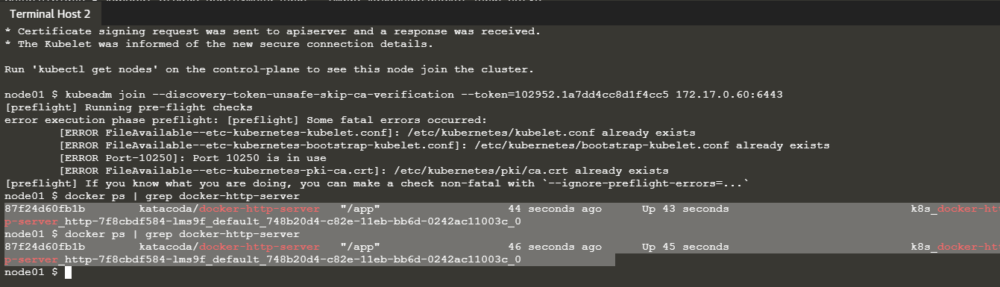
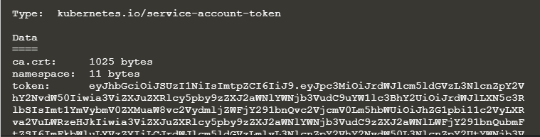
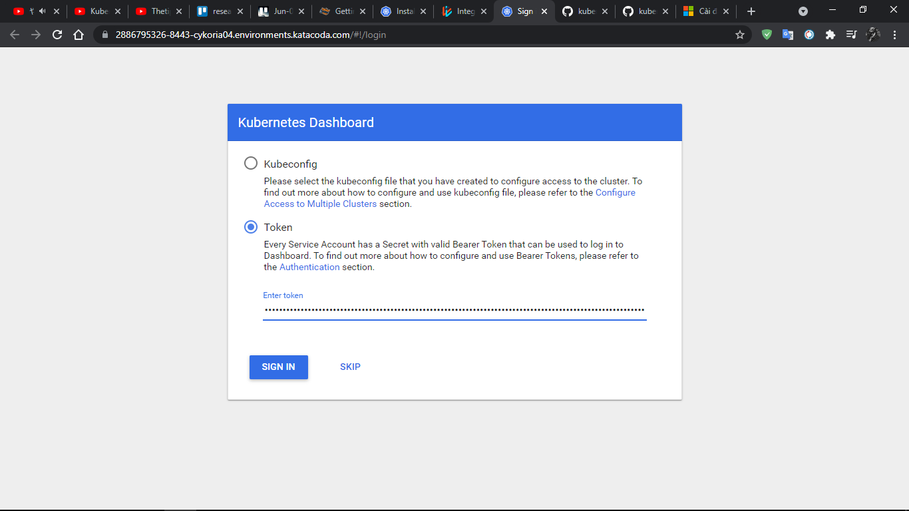
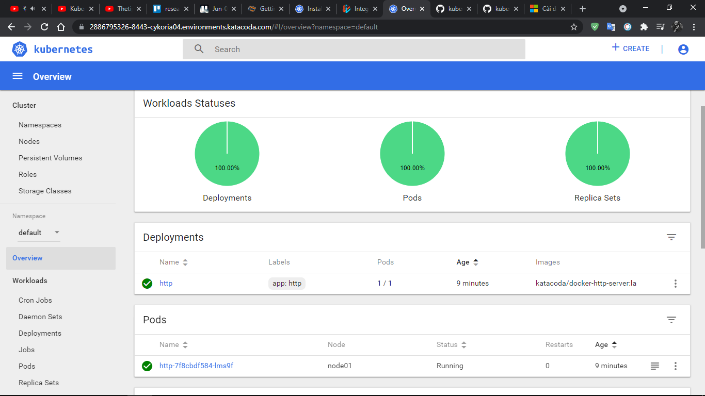

# Học cách khởi động Kubernetes Cluster bằng Kubeadm.

Kubeadm giải quyết vấn đề xử lý cấu hình mã hóa TLS (TLS encryption configuration), triển khai các thành phần Kubernetes cốt lõi và đảm bảo rằng các Nodes có thể dễ dàng tham gia vào Cluster. Một Cluster tạo bởi Kubedm được bảo mật thông qua các cơ chế như RBAC.

Thông tin chi tiết về cài đặt và sử dụng Kubeadm tại https://github.com/kubernetes/kubeadm

## Step 1 - Initialise Master
Sau khi cài đặt Kubeadm, ta có các Packages có sẵn như Ubuntu 16.04+, CentOS 7 hoặc HypriotOS v1.0.1 +.

Giai đoạn đầu tiên của quá trình khởi tạo Cluster là khởi chạy Node `Master`. Master chịu trách nhiệm chạy  control plane components, etcd và API Server. Clients sẽ giao tiếp với API để lên lịch khối lượng công việc và quản lý trạng thái của Cluster.

Lệnh dưới đây sẽ khởi tạo Cluster với một mã token cho trước để đơn giản hóa các bước thực hiện:

`kubeadm init --token=102952.1a7dd4cc8d1f4cc5 --kubernetes-version`

`kubeadm version -o short`

Để quản lý cụm Kubernetes, cấu hình cho clients và certificates là bắt buộc. Cấu hình này được tạo khi kubeadm khởi chạy cluster. Lệnh sao chép cấu hình vào thư mục chính của người dùng và đặt biến môi trường để sử dụng với CLI như sau:

`sudo cp /etc/kubernetes/admin.conf $HOME/`

`sudo chown $(id -u):$(id -g) $HOME/admin.conf`

`export KUBECONFIG=$HOME/admin.conf `

## Step 2 - Deploy Container Networking Interface (CNI)

Container Networking Interface (CNI) xác định cách các nút khác nhau và khối lượng công việc của chúng sẽ giao tiếp. Có nhiều nhà cung cấp mạng có sẵn, một số được liệt kê ở [đây](https://kubernetes.io/docs/concepts/cluster-administration/addons/)

Trong trường hợp này, mình sẽ sử dụng WeaveWorks do katacoda chỉ định. Định nghĩa cấu hình cho deployment được cung cấp tại file `cat/opt/weave-kube.yaml` và triển khai bằng cách sử dụng kubectl apply:

`kubectl apply -f /opt/weave-kube.yaml`

Giờ đây, Weave sẽ triển khai dưới dạng một loạt các Pods trên Cluster, ta có thể sử dụng lệnh `kubectl get pod -n kube-system` để xem trạng thái của các pods có trong Cluster.

Đường dẫn này là nguồn tham khảo chi tiết về [Weave](https://www.weave.works/docs/net/latest/kube-addon/)

## Step 3 - Join Cluster
Khi Master và CNI đã khởi tạo, các Node bổ sung (additional nodes) có thể tham gia vào cluster thông qua mã token. Các mã token có thể được quản lý thông qua `kubeadm token`, ví dụ:
`kubeadm token list`

Trên một máy khác ( với bài thực hành của katacoda, gọi đây là node01), ta mở terminal và chạy lệnh join vào cluster được cung cấp bới địa chỉ IP của nút Master.

`kubeadm join --discovery-token-unsafe-skip-ca-verification --token=102952.1a7dd4cc8d1f4cc5 172.17.0.60:6443`

Đây là lệnh được cung cấp sau khi Master đã được khởi tạo.

Thẻ `--discovery-token-unsafe-skip-ca-verification` được sử dụng để xác minh Discovery Token verification. Vì mã token này được generated dynamically nên ta không thể tự đưa nó vào mà phải sử dụng mã token do kubeadm init cung cấp.

## Step 4 - View Nodes

Cluster hiện đã được khởi tạo. Node Master sẽ quản lý Cluster, trong khi đó một node Worker sẽ chạy khối lượng công việc của các container.

Kubernetes CLI, được gọi là kubectl, có thể sử dụng cấu hình để truy cập vào cluster. Ví dụ: lệnh dưới đây sẽ trả về hai node trong cluster của chúng ta.

`kubectl get nodes`

## Step 5 - Deploy Pod
Trạng thái của hai node trong cluster bây giờ phải là Ready. Điều này có nghĩa là deployment này có thể được lên lịch và khởi chạy.

Sử dụng Kubectl để deploy các pods. Các lệnh luôn được cấp cho Master, mỗi node chỉ chịu trách nhiệm thực hiện các khối lượng công việc của container

Lệnh dưới đây tạo Pod dựa trên Docker Image katacoda/docker-http-server.
`kubectl create deployment http --image=katacoda/docker-http-server:latest`

Sau khi tạo Pod, ta có thể xem Docker Container đang chạy trên node01.
`docker ps | grep docker-http-server`

Kết quả như hình bên dưới



## Step 6 - Deploy Dashboard
Triển khai Dashboard yaml bằng lệnh
`kubectl apply -f dashboard.yaml`

Xem trạng thái deploy với `kubectl get pods -n kube-system`

Khi này ta cần một ServiceAccount để đăng nhập. Một ClusterRoleBinding do katacoda cung cấp được sử dụng để chỉ định ServiceAccount mới (admin-user) với vai trò của cluster-admin trên Cluster:

```cat <<EOF | kubectl create -f - 
apiVersion: v1
kind: ServiceAccount
metadata:
  name: admin-user
  namespace: kube-system
---
apiVersion: rbac.authorization.k8s.io/v1beta1
kind: ClusterRoleBinding
metadata:
  name: admin-user
roleRef:
  apiGroup: rbac.authorization.k8s.io
  kind: ClusterRole
  name: cluster-admin
subjects:
- kind: ServiceAccount
  name: admin-user
  namespace: kube-system
EOF
```

Admin có thể kiểm soát tất cả các tác vụ của Kubernetes trên Dashboard. Với ClusterRoleBinding và RBAC, các mức quyền khác nhau có thể được xác định dựa trên các yêu cầu bảo mật. Để xem cụ thể hơn thông tin về cách tạo người dùng cho Dashboard có thể đọc trong [Dashboard documentation](https://github.com/kubernetes/dashboard/tree/master/docs)

Khi ServiceAccount đã được tạo, ta có thể tìm thấy mã token để đăng nhập bằng câu lệnh
`kubectl -n kube-system describe secret $(kubectl -n kube-system get secret | grep admin-user | awk '{print $1}')`

Kết quả là:



Khi deloy xong Dashboard, bài thực hành trên katacoda liên kết dịch vụ với cổng 8443. Điều này làm cho Dashboard available bên ngoài Cluster và có thể xem tại `https://2886795326-8443-cykoria04.environments.katacoda.com/`



Sử dụng admin-user token để truy cập vào dashboard. Giao diện Dashboard tương tự với bài lab trước



