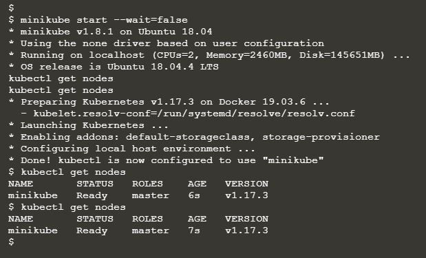
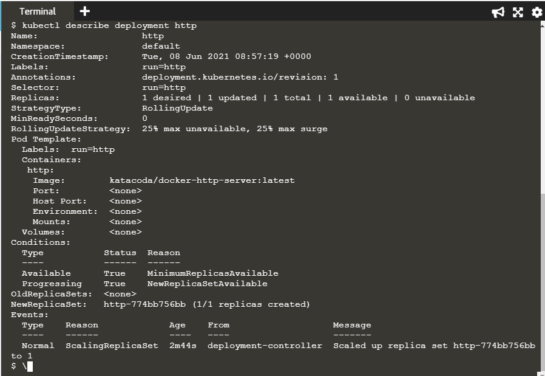
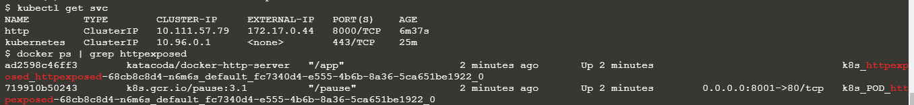
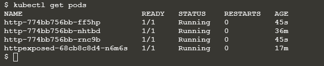
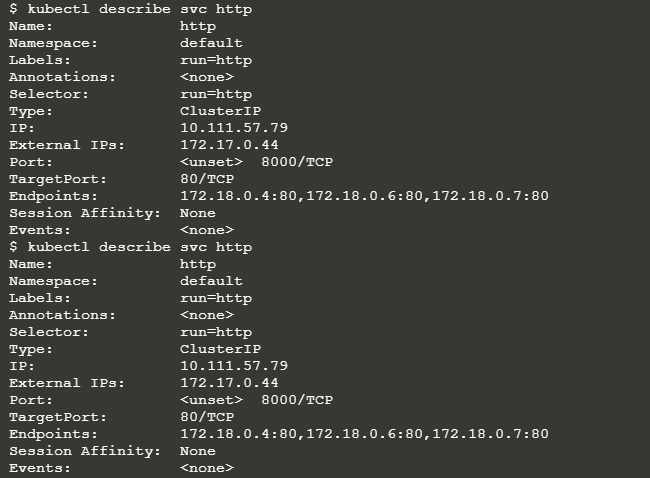

# Deploy Containers using Kubectl

Học cách sử dụng Kubectl để tạo và khởi chạy Deployments,  Replication Controllers ( ReplicaSet) và hiển thị chúng qua Services mà không cần viết định nghĩa yaml. Điều này cho phép ta nhanh chóng khởi chạy các containers vào Cluster.

## Step 1 - Launch Cluster
Bước đầu tiên chúng ta cần khởi chạy một Kubernetes cluster.

Thực hiện lệnh dưới đây để khởi động các thành phần Cluster và tải xuống Kubectl CLI.

`minikube start --wait=false`

Kiểm tra các Nodes có Ready chưa bằng `kubectl get nodes`

## Step 2 - Kubectl Run

Lệnh run tạo ra một deployment dựa trên các tham số được chỉ định, chẳng hạn như Image hoặc Replicas. 
Việc deployment này được cấp cho Kubernetes Master khởi chạy các Pod và Containers. Có thể hiểu kubectl run tương tự như docker run nhưng ở cấp độ Cluster.
Cú pháp của kubectl run là `kubectl run <name of deployment> <properties>`

Trong bước này, ta dùng lệnh `kubectl run http --image=katacoda/docker-http-server:latest --replicas=1`

Lệnh này sẽ khởi chạy một Deployment có tên là http sẽ bắt đầu một container dựa trên Docker Image <i>katacoda/docker-http-server:latest</i>

Sau đó ta có thể sử dụng kubectl để xem trạng thái của Deployment `kubectl get deployments`

Để tìm hiểu những gì Kubernetes đã tạo, ta có thể mô tả quá trình deployment bằng câu lệnh:

`kubectl describe deployment http`

Describe này mô tả một depoyment http bao gồm số lượng replicas đang trạng thái available, các Labels được chỉ định và còn có Pod Template định nghĩa một Pod khi được thêm vào deployment.
Ngoài ra còn có các events khác liên quan đến deployment. Những events này sẽ giúp ta tìm ra bất kỳ vấn đề và lỗi nào có thể đã xảy ra với deployments.

## Step 3 - Kubectl Expose

Với việc tạo ra deployment nhưu trên, ta có thể sử dụng kubectl để tạo một service hiển thị các Pod trên một Port cụ thể.

Ta sẽ Expose cái thằng deployments http mới được deploy thông qua kubectl expose, nó cho phép ta xác định các tham số khác nhau của service và cách hiển thị việc deployment.

Cụ thể, mình sử dụng lệnh sau để hiển thị port của container 80 trên máy chủ 8000 ràng buộc với ip bên ngoài của máy chủ host:

`kubectl expose deployment http --external-ip="172.17.0.44" --port=8000 --target-port=80`

Sau đó khi chạy lệnh này thành công, ta có thể ping từ máy host và xem kết quả từ dịch vụ HTTP

`curl http://172.17.0.44:8000`

## Step 4 - Kubectl Run and Expose
Với kubectl run, ta có thể tạo và expose deployment trong cùng một dòng lệnh như sau:

`kubectl run httpexposed --image=katacoda/docker-http-server:latest --replicas=1 --port=80 --hostport=8001`

Ở đây ta không thể expose các Pod như là Docker Port Mapping bằng câu lệnh `kubectl get svc` mà phải sử dụng lệnh `docker ps | grep httpexposed` để xem chi tiết

Như kết quả ở trên, ta nhận thấy các Port được hiển thị trên Pod chứ không phải chính container http. Container Pause chịu trách nhiệm xác định network cho Pod. Các containers khác trong Pod chia sẻ cùng một network namespace. 
Điều này giúp cải thiện hiệu suất của một netwwork và cho phép nhiều containers giao tiếp với nhau qua cùng một network interface

## Step 05 Scale Containers

Với deployment đang chạy, giờ ta có thể sử dụng kubectl để mở rộng số lượng replicas.

Mở rộng quy mô deployment sẽ yêu cầu Kubernetes khởi chạy các Pod bổ sung. Sau đó, các Pod này sẽ tự động được cân bằng tải bằng Service.

Sử dụng lệnh `kubectl scale` cho phép chúng ta điều chỉnh số lượng Pod đang chạy trên một deployments và có thể tủy chỉnh quy mô của nó một cách cụ thể.

`kubectl scale --replicas=3 deployment http`

Liệt kê tất cả các Pods, ta sẽ thấy có 3 Pod đang chạy để triển khai http

Khi mỗi Pod khởi động, nó sẽ được thêm vào Service để cân bằng tải. Ta có thể describle cái service này để xem endpoint và các Pods liên quan:

`kubectl describe svc http`

Ta kiểm tra bằng cách ping tới địa chỉ sau: `curl http://172.17.0.44:8000`

