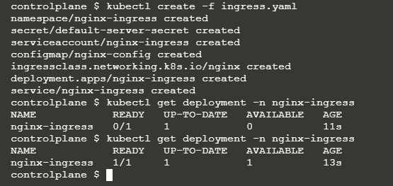
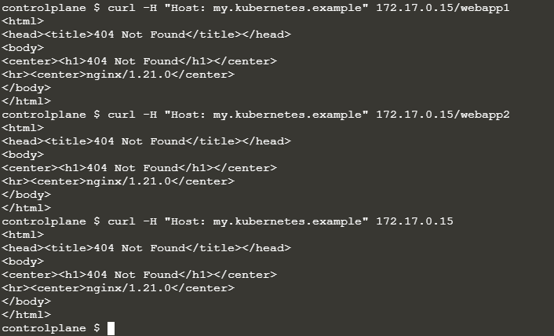

# Create Ingress Routing
Ingress là thành phần được dùng để điều hướng các yêu cầu traffic giao thức HTTP và HTTPS từ bên ngoài (interneet) vào các dịch vụ bên trong Cluster.

Ingress chỉ để phục vụ các cổng, yêu cầu HTTP, HTTPS còn các loại cổng khác, giao thức khác để truy cập được từ bên ngoài thì dùng Service với kiểu NodePort và LoadBalancer

Để Ingress hoặt động, hệ thồng cần một điều khiển ingress trước (Ingress controller), có nhiều loại để chọn sử dụng tham khảo thêm tại: [Ingress Controller](https://kubernetes.io/docs/concepts/services-networking/ingress-controllers/#additional-controllers)

## Step 1 - Create Deployment

Để bắt đầu ta sẽ deploy một máy chủ HTTP mẫu để làm mục tiêu cho các requests. Việc triển khai chứa ba bản deployment lần lượt là webapp1, webapp2, webapp3 và với mỗi bản sẽ có 1 Service.
Cụ thể như sau:

```
controlplane $ cat deployment.yaml
apiVersion: apps/v1
kind: Deployment
metadata:
  name: webapp1
spec:
  replicas: 1
  selector:
    matchLabels:
      app: webapp1
  template:
    metadata:
      labels:
        app: webapp1
    spec:
      containers:
      - name: webapp1
        image: katacoda/docker-http-server:latest
        ports:
        - containerPort: 80
---
apiVersion: apps/v1
kind: Deployment
metadata:
  name: webapp2
spec:
  replicas: 1
  selector:
    matchLabels:
      app: webapp2
  template:
    metadata:
      labels:
        app: webapp2
    spec:
      containers:
      - name: webapp2
        image: katacoda/docker-http-server:latest
        ports:
        - containerPort: 80
---
apiVersion: apps/v1
kind: Deployment
metadata:
  name: webapp3
spec:
  replicas: 1
  selector:
    matchLabels:
      app: webapp3
  template:
    metadata:
      labels:
        app: webapp3
    spec:
      containers:
      - name: webapp3
        image: katacoda/docker-http-server:latest
        ports:
        - containerPort: 80
---
apiVersion: v1
kind: Service
metadata:
  name: webapp1-svc
  labels:
    app: webapp1
spec:
  ports:
  - port: 80
  selector:
    app: webapp1
---
apiVersion: v1
kind: Service
metadata:
  name: webapp2-svc
  labels:
    app: webapp2
spec:
  ports:
  - port: 80
  selector:
    app: webapp2
---
apiVersion: v1
kind: Service
metadata:
  name: webapp3-svc
  labels:
    app: webapp3
spec:
  ports:
  - port: 80
  selector:
    app: webapp3
```

Ta deploy các định nghĩa trên qua câu lệnh: `kubectl apply -f deployment.yaml` và xem kết quả qua `kubectl get deployment`: 


## Step 2 - Deploy Ingress
```
controlplane $ cat ingress.yaml
apiVersion: v1
kind: Namespace
metadata:
  name: nginx-ingress
---
apiVersion: v1
kind: Secret
metadata:
  name: default-server-secret
  namespace: nginx-ingress
type: kubernetes.io/tls
data:
  tls.crt: LS0tLS1CRUdJTiBDRVJUSUZJQ0FURS0tLS0tCk1JSUN2akNDQWFZQ0NRREFPRjl0THNhWFhEQU5CZ2txaGtpRzl3MEJBUXNGQURBaE1SOHdIUVlEVlFRRERCWk8KUjBsT1dFbHVaM0psYzNORGIyNTBjbTlzYkdWeU1CNFhEVEU0TURreE1qRTRNRE16TlZvWERUSXpNRGt4TVRFNApNRE16TlZvd0lURWZNQjBHQTFVRUF3d1dUa2RKVGxoSmJtZHlaWE56UTI5dWRISnZiR3hsY2pDQ0FTSXdEUVlKCktvWklodmNOQVFFQkJRQURnZ0VQQURDQ0FRb0NnZ0VCQUwvN2hIUEtFWGRMdjNyaUM3QlBrMTNpWkt5eTlyQ08KR2xZUXYyK2EzUDF0azIrS3YwVGF5aGRCbDRrcnNUcTZzZm8vWUk1Y2Vhbkw4WGM3U1pyQkVRYm9EN2REbWs1Qgo4eDZLS2xHWU5IWlg0Rm5UZ0VPaStlM2ptTFFxRlBSY1kzVnNPazFFeUZBL0JnWlJVbkNHZUtGeERSN0tQdGhyCmtqSXVuektURXUyaDU4Tlp0S21ScUJHdDEwcTNRYzhZT3ExM2FnbmovUWRjc0ZYYTJnMjB1K1lYZDdoZ3krZksKWk4vVUkxQUQ0YzZyM1lma1ZWUmVHd1lxQVp1WXN2V0RKbW1GNWRwdEMzN011cDBPRUxVTExSakZJOTZXNXIwSAo1TmdPc25NWFJNV1hYVlpiNWRxT3R0SmRtS3FhZ25TZ1JQQVpQN2MwQjFQU2FqYzZjNGZRVXpNQ0F3RUFBVEFOCkJna3Foa2lHOXcwQkFRc0ZBQU9DQVFFQWpLb2tRdGRPcEsrTzhibWVPc3lySmdJSXJycVFVY2ZOUitjb0hZVUoKdGhrYnhITFMzR3VBTWI5dm15VExPY2xxeC9aYzJPblEwMEJCLzlTb0swcitFZ1U2UlVrRWtWcitTTFA3NTdUWgozZWI4dmdPdEduMS9ienM3bzNBaS9kclkrcUI5Q2k1S3lPc3FHTG1US2xFaUtOYkcyR1ZyTWxjS0ZYQU80YTY3Cklnc1hzYktNbTQwV1U3cG9mcGltU1ZmaXFSdkV5YmN3N0NYODF6cFErUyt1eHRYK2VBZ3V0NHh3VlI5d2IyVXYKelhuZk9HbWhWNThDd1dIQnNKa0kxNXhaa2VUWXdSN0diaEFMSkZUUkk3dkhvQXprTWIzbjAxQjQyWjNrN3RXNQpJUDFmTlpIOFUvOWxiUHNoT21FRFZkdjF5ZytVRVJxbStGSis2R0oxeFJGcGZnPT0KLS0tLS1FTkQgQ0VSVElGSUNBVEUtLS0tLQo=
  tls.key: LS0tLS1CRUdJTiBSU0EgUFJJVkFURSBLRVktLS0tLQpNSUlFcEFJQkFBS0NBUUVBdi91RWM4b1JkMHUvZXVJTHNFK1RYZUprckxMMnNJNGFWaEMvYjVyYy9XMlRiNHEvClJOcktGMEdYaVN1eE9ycXgrajlnamx4NXFjdnhkenRKbXNFUkJ1Z1B0ME9hVGtIekhvb3FVWmcwZGxmZ1dkT0EKUTZMNTdlT1l0Q29VOUZ4amRXdzZUVVRJVUQ4R0JsRlNjSVo0b1hFTkhzbysyR3VTTWk2Zk1wTVM3YUhudzFtMApxWkdvRWEzWFNyZEJ6eGc2clhkcUNlUDlCMXl3VmRyYURiUzc1aGQzdUdETDU4cGszOVFqVUFQaHpxdmRoK1JWClZGNGJCaW9CbTVpeTlZTW1hWVhsMm0wTGZzeTZuUTRRdFFzdEdNVWozcGJtdlFmazJBNnljeGRFeFpkZFZsdmwKMm82MjBsMllxcHFDZEtCRThCay90elFIVTlKcU56cHpoOUJUTXdJREFRQUJBb0lCQVFDZklHbXowOHhRVmorNwpLZnZJUXQwQ0YzR2MxNld6eDhVNml4MHg4Mm15d1kxUUNlL3BzWE9LZlRxT1h1SENyUlp5TnUvZ2IvUUQ4bUFOCmxOMjRZTWl0TWRJODg5TEZoTkp3QU5OODJDeTczckM5bzVvUDlkazAvYzRIbjAzSkVYNzZ5QjgzQm9rR1FvYksKMjhMNk0rdHUzUmFqNjd6Vmc2d2szaEhrU0pXSzBwV1YrSjdrUkRWYmhDYUZhNk5nMUZNRWxhTlozVDhhUUtyQgpDUDNDeEFTdjYxWTk5TEI4KzNXWVFIK3NYaTVGM01pYVNBZ1BkQUk3WEh1dXFET1lvMU5PL0JoSGt1aVg2QnRtCnorNTZud2pZMy8yUytSRmNBc3JMTnIwMDJZZi9oY0IraVlDNzVWYmcydVd6WTY3TWdOTGQ5VW9RU3BDRkYrVm4KM0cyUnhybnhBb0dCQU40U3M0ZVlPU2huMVpQQjdhTUZsY0k2RHR2S2ErTGZTTXFyY2pOZjJlSEpZNnhubmxKdgpGenpGL2RiVWVTbWxSekR0WkdlcXZXaHFISy9iTjIyeWJhOU1WMDlRQ0JFTk5jNmtWajJTVHpUWkJVbEx4QzYrCk93Z0wyZHhKendWelU0VC84ajdHalRUN05BZVpFS2FvRHFyRG5BYWkyaW5oZU1JVWZHRXFGKzJyQW9HQkFOMVAKK0tZL0lsS3RWRzRKSklQNzBjUis3RmpyeXJpY05iWCtQVzUvOXFHaWxnY2grZ3l4b25BWlBpd2NpeDN3QVpGdwpaZC96ZFB2aTBkWEppc1BSZjRMazg5b2pCUmpiRmRmc2l5UmJYbyt3TFU4NUhRU2NGMnN5aUFPaTVBRHdVU0FkCm45YWFweUNweEFkREtERHdObit3ZFhtaTZ0OHRpSFRkK3RoVDhkaVpBb0dCQUt6Wis1bG9OOTBtYlF4VVh5YUwKMjFSUm9tMGJjcndsTmVCaWNFSmlzaEhYa2xpSVVxZ3hSZklNM2hhUVRUcklKZENFaHFsV01aV0xPb2I2NTNyZgo3aFlMSXM1ZUtka3o0aFRVdnpldm9TMHVXcm9CV2xOVHlGanIrSWhKZnZUc0hpOGdsU3FkbXgySkJhZUFVWUNXCndNdlQ4NmNLclNyNkQrZG8wS05FZzFsL0FvR0FlMkFVdHVFbFNqLzBmRzgrV3hHc1RFV1JqclRNUzRSUjhRWXQKeXdjdFA4aDZxTGxKUTRCWGxQU05rMXZLTmtOUkxIb2pZT2pCQTViYjhibXNVU1BlV09NNENoaFJ4QnlHbmR2eAphYkJDRkFwY0IvbEg4d1R0alVZYlN5T294ZGt5OEp0ek90ajJhS0FiZHd6NlArWDZDODhjZmxYVFo5MWpYL3RMCjF3TmRKS2tDZ1lCbyt0UzB5TzJ2SWFmK2UwSkN5TGhzVDQ5cTN3Zis2QWVqWGx2WDJ1VnRYejN5QTZnbXo5aCsKcDNlK2JMRUxwb3B0WFhNdUFRR0xhUkcrYlNNcjR5dERYbE5ZSndUeThXczNKY3dlSTdqZVp2b0ZpbmNvVlVIMwphdmxoTUVCRGYxSjltSDB5cDBwWUNaS2ROdHNvZEZtQktzVEtQMjJhTmtsVVhCS3gyZzR6cFE9PQotLS0tLUVORCBSU0EgUFJJVkFURSBLRVktLS0tLQo=
---
apiVersion: v1
kind: ServiceAccount
metadata:
  name: nginx-ingress 
  namespace: nginx-ingress
---
kind: ConfigMap
apiVersion: v1
metadata:
  name: nginx-config
  namespace: nginx-ingress
data:
---
# Described at: https://docs.nginx.com/nginx-ingress-controller/installation/installation-with-manifests/
# Source from: https://github.com/nginxinc/kubernetes-ingress/blob/master/deployments/common/ingress-class.yaml
apiVersion: networking.k8s.io/v1beta1
kind: IngressClass
metadata:
  name: nginx
  # annotations:
  #   ingressclass.kubernetes.io/is-default-class: "true"
spec:
  controller: nginx.org/ingress-controller
---
apiVersion: apps/v1
kind: Deployment
metadata:
  name: nginx-ingress
  namespace: nginx-ingress
spec:
  replicas: 1
  selector:
    matchLabels:
      app: nginx-ingress
  template:
    metadata:
      labels:
        app: nginx-ingress
    spec:
      serviceAccountName: nginx-ingress
      containers:
      - image: nginx/nginx-ingress:edge
        imagePullPolicy: Always
        name: nginx-ingress
        ports:
        - name: http
          containerPort: 80
        - name: https
          containerPort: 443
        env:
        - name: POD_NAMESPACE
          valueFrom:
            fieldRef:
              fieldPath: metadata.namespace
        - name: POD_NAME
          valueFrom:
            fieldRef:
              fieldPath: metadata.name
        args:
          - -nginx-configmaps=$(POD_NAMESPACE)/nginx-config
          - -default-server-tls-secret=$(POD_NAMESPACE)/default-server-secret
---
apiVersion: v1
kind: Service
metadata:
  name: nginx-ingress
  namespace: nginx-ingress
spec:
  type: NodePort 
  ports:
  - port: 80
    targetPort: 80
    protocol: TCP
    name: http
  - port: 443
    targetPort: 443
    protocol: TCP
    name: https
  selector:
    app: nginx-ingress
  externalIPs:
    - 172.17.0.15
```

Tệp YAML ingress.yaml định nghĩa một Ingress controller dựa trên Nginx cùng với một Service cho phép nó chạy được trên Port 80 với các kết nối bên ngoài bằng các ExternalIP. 
Nếu Kubernetes Cluster đang chạy trên một nhà cung cấp dịch vụ Cloud thì nó sẽ sử dụng loại dịch vụ LoadBalancer.

ServiceAccount định nghĩa một tài khoản với một tập hợp các quyền về cách truy cập vào Cluster để truy cập đến các Ingress Rules. Cái server secret mặc định là một self-signed certificate cho các kết nối Nginx example SSL khác và được yêu cầu bởi [Nginx Default Example](https://github.com/nginxinc/kubernetes-ingress/tree/master/deployments)

Ta dùng câu lệnh `kubectl create -f ingress.yaml` để deploy Ingress controllers và `kubectl get deployment -n nginx-ingress` để xem trạng thái như sau:



## Step 3 - Deploy Ingress Rules
Ingress rules là một loại objects trong Kubernetes. Các quy tắc này có thể dựa trên request host (domain) hoặc đường dẫn của request hoặc kết hợp cả hai. Một bộ quy tắc mẫu được xác định trong `ingress-rules.yaml`:

```
apiVersion: extensions/v1beta1
kind: Ingress
metadata:
  name: webapp-ingress
spec:
  ingressClassName: nginx
  rules:
  - host: my.kubernetes.example
    http:
      paths:
      - path: /webapp1
        backend:
          serviceName: webapp1-svc
          servicePort: 80
      - path: /webapp2
        backend:
          serviceName: webapp2-svc
          servicePort: 80
      - backend:
          serviceName: webapp3-svc
          servicePort: 80
```

Các quy tắc áp như trên dụng cho các requets đối với host `my.kubernetes.example`. 
Có hai quy tắc được xác định dựa trên path request với một định nghĩa catch tất cả. Các request đến đường dẫn /webapp1 được chuyển tiếp đến service webapp1-svc. Tương tự như vậy, các request đến /webapp2 sẽ được chuyển tiếp đến webapp2-svc. Nếu không có quy tắc nào được áp dụng thì webapp3-svc sẽ được sử dụng như vậy luôn.

Điều này cho thấy cách cấu trúc URL của ứng dụng có thể hoạt động độc lập về cách các ứng dụng được triển khai.

Tương tự như với tất cả các objects trong Kubernetes, `ingress-rules.yaml` có thể được deploy qua `kubectl create -f ingress-rules.yaml` và xem trạng thái của Ingress rules bằng `kubectl get ing` :


## Step 4 - Test

Với các Ingress rules được triển khai ở trên, lưu lượng truy cập sẽ được chuyển đến các địa điểm đã được xác định. 
Các request sẽ được xử lý bởi deployment webapp1, webapp2 và webapp3 thông qua câu lệnh `curl -H "Host: my.kubernetes.example" 172.17.0.15/webapp1`, `curl -H "Host: my.kubernetes.example" 172.17.0.15/webapp2` và `curl -H "Host: my.kubernetes.example" 172.17.0.15/webapp3`

