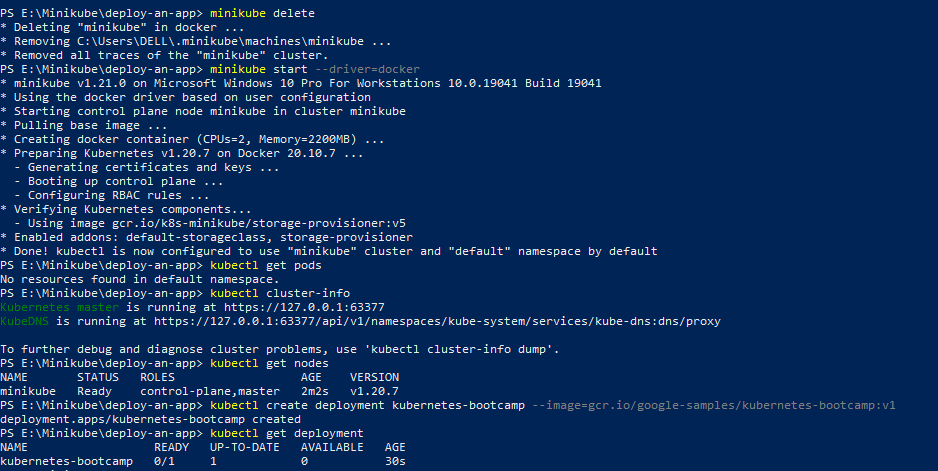
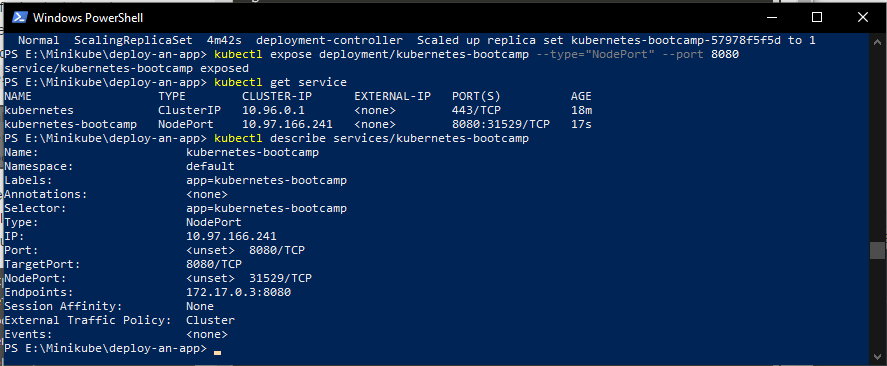
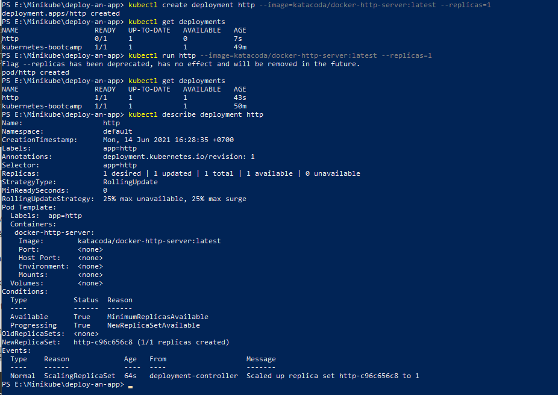

# Deploy an app

# Deploy using kubectl

Tạo một Deployment kubernetes-bootcamp

`kubectl create deployment kubernetes-bootcamp --image=gcr.io/google-samples/kubernetes-bootcamp:v1`

Expose deployment kubernetes-bootcamp kubernetes-bootcamp

`kubectl expose deployment/kubernetes-bootcamp --type="NodePort" --port 8080`

`kubectl describe services/kubernetes-bootcamp`

Tạo một deployment mới, cc bước thực hiện dựa trên: [Day05-Jun-8/3.Deploy-Containers-Using-Kubectl](https://github.com/smoothkt4951/kubernetes-notebook/tree/main/Day05-Jun-8/3.Deploy-Containers-Using-Kubectl)

Thử ping thì bị lỗi 😥

# Deploy using YAML
