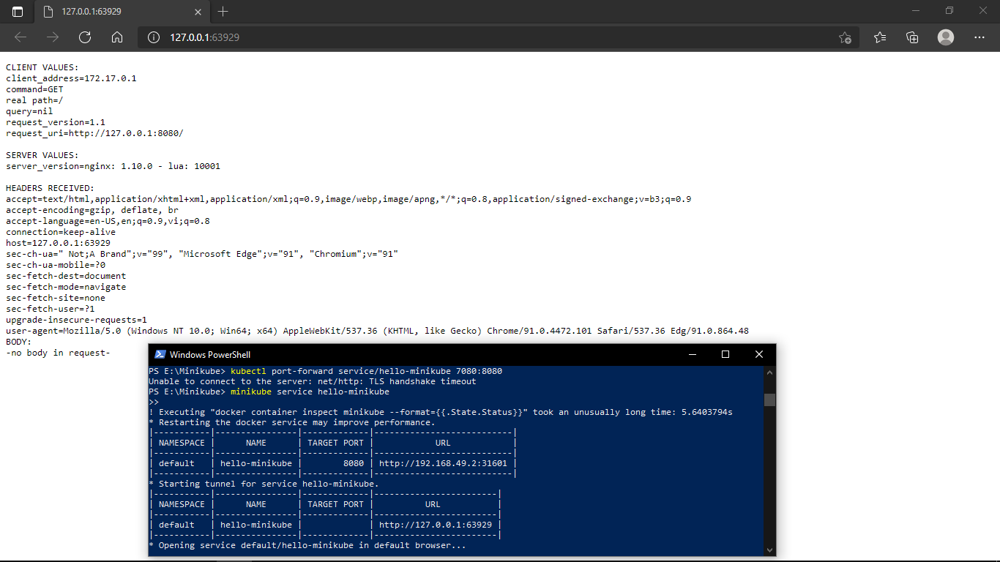

# Launch Single Node Kubernetes Cluster - minikube start
## Step 1, 2: Khởi động Minikube và Xem thông tin Kubernetes Cluster

Cài đặt dựa trên hướng dẫn của minikube.

Khởi động cluster bằng cách chạy lệnh minikube start với driver là Docker: `minikube start --driver=docker`

Ta có thể tương tác với Kubernetes Cluster bằng cách sử dụng kubectl CLI. Đây là cách tiếp cận chính được sử dụng để quản lý Kubernetes và các ứng dụng chạy trên cùng Kubernetes Cluster.

Để xem thông tin chi tiết của Kubernetes Cluster, ta chạy lệnh: `kubectl cluster-info`

Để xem thông tin tất cả các node trong cluster: `kubectl get nodes`

Truy cập tới Cluster vừa tạo: `kubectl get po -A`. Kết quả như sau:

Ban đầu, một số service chẳng hạn như trình cung cấp bộ nhớ có thể chưa ở trạng thái Running. Đây là tình trạng bình thường trong quá trình khởi động Cluster và sẽ được tự giải quyết trong giây lát. Để có thêm thông tin chi tiết về trạng thái của Cluster, minikube cung cấp một package Kubernetes Dashboard, cho phép ta dễ dàng làm quen, tiếp cận với môi trường mới của mình:

## Step 4 - Deploy Containers
Tạo một Depoloyment và hiển thị nó trên Port 8080:
`kubectl create deployment hello-minikube --image=k8s.gcr.io/echoserver:1.4` , sau đó chạy lệnh `kubectl expose deployment hello-minikube --type=NodePort --port=8080`
Đợi xíu cho tới khi tạo deployment xong, ta sử dụng lệnh `kubectl get services hello-minikube
` để truy cập đến service để minikube tự khởi chạy ứng dụng trên trình duyệt mặc định:

Sử dụng kubectl để chuyển tiếp cổng: `kubectl port-forward service/hello-minikube 7080:8080`.  Ứng dụng đã có thể chạy trên cổng 7080 như bên dưới:

Để truy cập LoadBalancer deployment ta sử dụng lệnh “minikube tunel”. Đây là một ví dụ:

`kubectl create deployment balanced --image=k8s.gcr.io/echoserver:1.4`

`kubectl expose deployment balanced --type=LoadBalancer --port=8080`

Mở một cửa sổ mới và chạy câu lệnh `minikube tunel` để tạo một IP có thể định tuyến cho việc LoadBalancer deployment:

Để tìm IP có thể định tuyến ta chạy lệnh `kubectl get services balanced` và xem ở cột EXTERNAL-IP:

Ứng dụng bây giờ đang được triển khai dưới cổng ` <EXTERNAL-IP>:8080`

## Manage your cluster

Ta có thể dừng Kubernetes với câu lệnh `minikube stop` và sau đó xóa minikube cluster với câu lệnh `minikube delete`:

