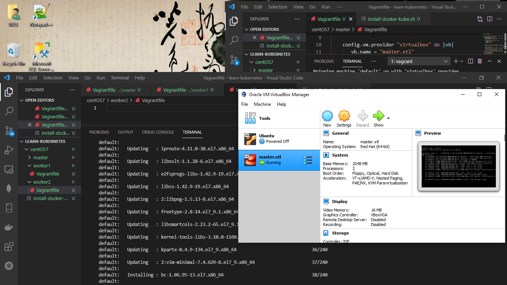
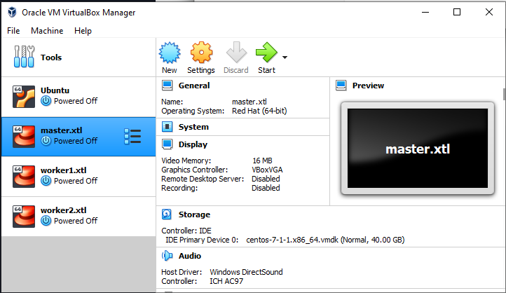
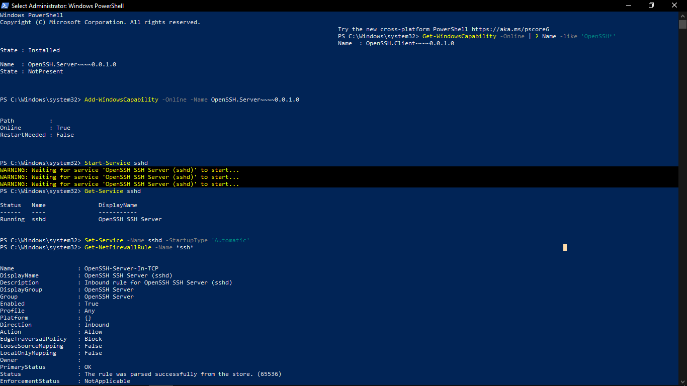
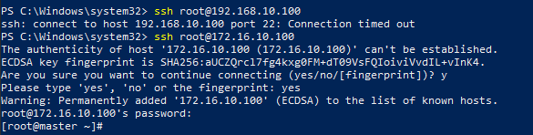
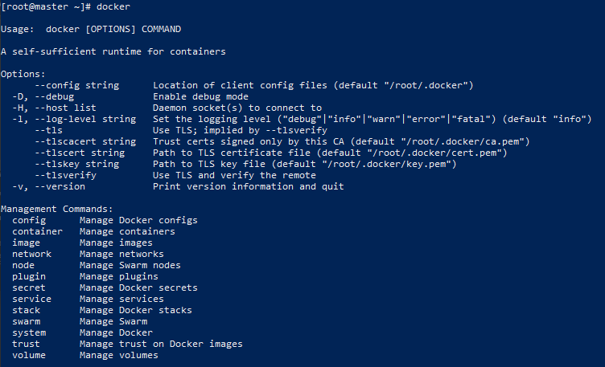

# Tạo Kubernetes Cluster
Tạo ra một Kubernetes Cluster hoàn chỉnh từ 3 máy (3 VPS - hay 3 Server) chạy CentOS:

Hệ thống này gồm:

| Tên máy/Hostname | Thông tin hệ thống  | Vai trò  | 
|---|---|---|
| master.xtl  | HĐH CentOS7, Docker CE, Kubernetes. Địa chỉ IP 172.16.10.100 | master |
| worker1.xtl | HĐH CentOS7, Docker CE, Kubernetes. Địa chỉ IP 172.16.10.101 | worker |
| worker2.xtl | HĐH CentOS7, Docker CE, Kubernetes. Địa chỉ IP 172.16.10.102 | worker |

### Tạo máy Master
Trong thự mục con master tạo file vagrantfile như sau: [Vagranfile](https://github.com/smoothkt4951/kubernetes-notebook/blob/main/diary/Day10-Jun-16/centOS7/master/Vagrantfile)
Sau đó chạy `vagrant up` tại thư mục chứa folder master và file [install-docker-kube.sh](https://github.com/smoothkt4951/kubernetes-notebook/blob/main/diary/Day10-Jun-16/centOS7/install-docker-kube.sh)

Quá trình tạo máy worker1 và worker2 tương tự với master:

### Enable ssh trên window để ssh tới các máy ảo Linux:

Sau đó ssh tới máy ảo dựa trên địa chỉ IP của máy, tại đây có thể tạo cluster sử dụng kubeadm trên máy master sau đó join các máy worker vào cluster.

Trong quá trình tạo máy ảo, docker và kubernetes đã được cài tự động luôn, tuy nhiên bị lỗi `connected refused ` nên mình cài đặt lại docker và kubernetes theo srcipt [Minikube-Installation](https://github.com/shazforiot/Minikube-Installation) của thetips4you

**Kiểm tra xem docker đã được cài trên máy chưa**

