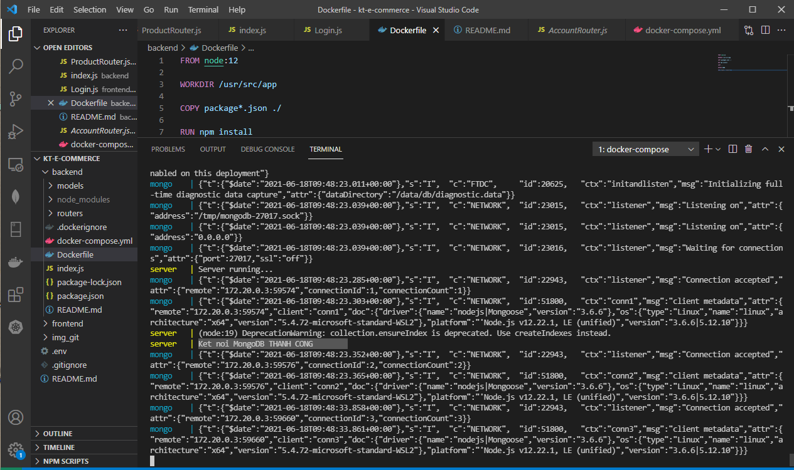
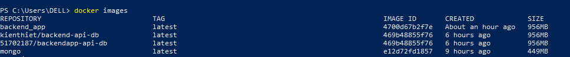
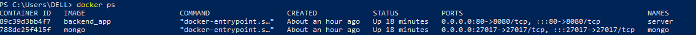
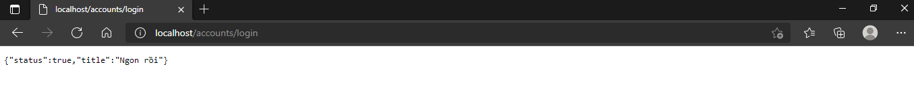
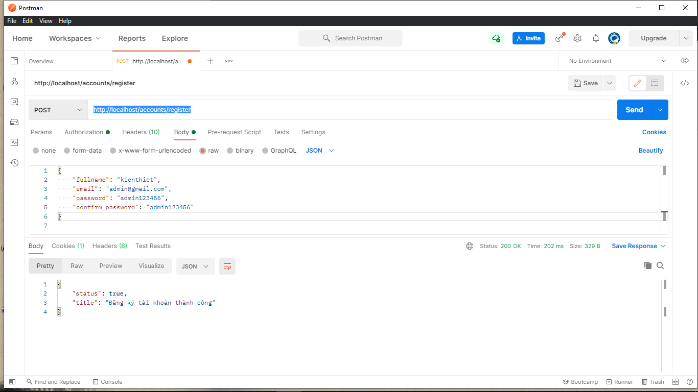
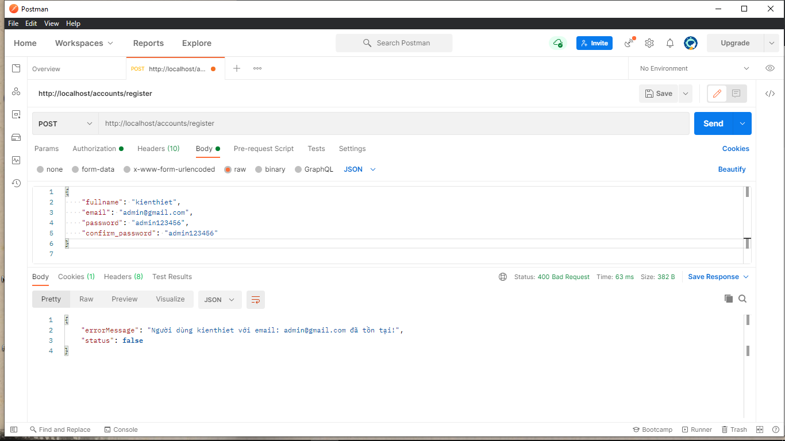

# Build and run NodeJS app in a Container
Link project tại: [KT-Ecommerce](https://github.com/smoothkt4951/KT-Ecommerce/tree/main/backend).
### Các bước thực hiện:

**1. Tạo Dockerfile và docker-compose.yml. Sau đó chạy lệnh `docker-compose up` tại thư mục `backend`.**

Kiểm tra Docker Image đã được tạo chưa:

Kiểm tra các Container đang chạy:

Đang có hai Container là `backend_app` chạy server và  `mongo` chạy MongoDB trên localhost.

**2. Truy cập đến các API Endpiont và test theo mô tả [tại đây](https://github.com/smoothkt4951/KT-Ecommerce/tree/main/backend)**

Server đã chạy trên local:

Do các API khác yêu cầu token từ header sau khi đã đăng nhập thành công mới có thể test được đồng thời API Login nhận mật khẩu đã hash từ bcrypt nên hiện tại không test các API khác trên Postman được. Thử POST với API Register:

Đã kết nối được với database:

**3. Build Docker Image và push lên DockerHub: [backend-api-db](https://hub.docker.com/r/kienthiet/backend-api-db)**

