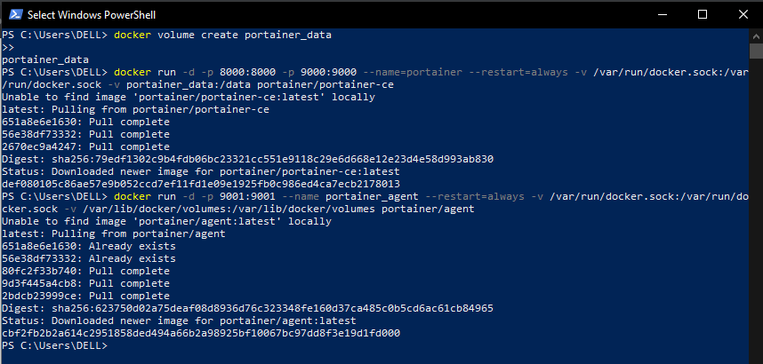
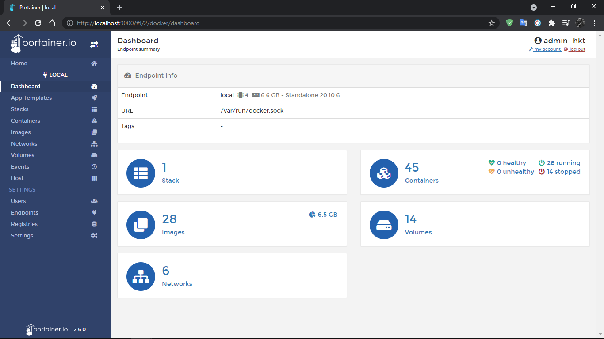
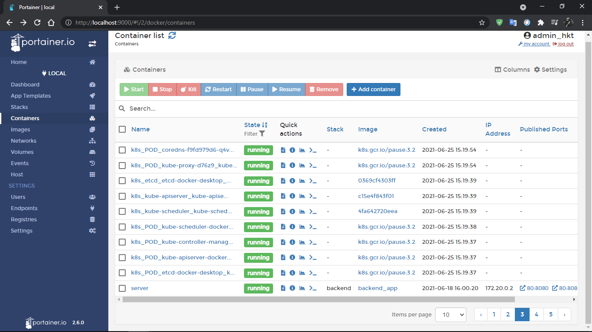
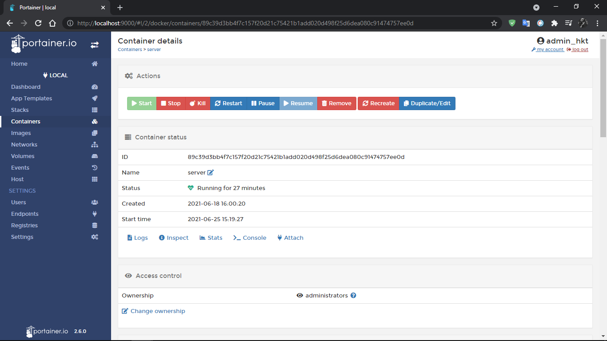

# Sử dụng Portainer để quản lý Docker
### Setup Portainer:

- Portainer Server Deployment:

`docker volume create portainer_data`

`docker run -d -p 8000:8000 -p 9000:9000 --name=portainer --restart=always -v /var/run/docker.sock:/var/run/docker.sock -v portainer_data:/data portainer/portainer-ce`

- Portainer Agent Only Deployment:

`docker run -d -p 9001:9001 --name portainer_agent --restart=always -v /var/run/docker.sock:/var/run/docker.sock -v /var/lib/docker/volumes:/var/lib/docker/volumes portainer/agent`

Kết quả:

Build and run [NodeJS app](https://github.com/smoothkt4951/KT-Ecommerce/tree/main/backend) trên Docker Container và quản lý trên Portainer:

Giao diện Dashboard:

Giao diện quản lý các Container

_Xem thêm chi tiết và hướng dẫn tại [Advanced Options](https://documentation.portainer.io/v2.0/deploy/ceinstalldocker/)
_

