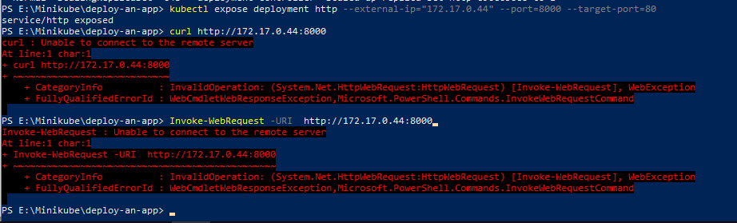
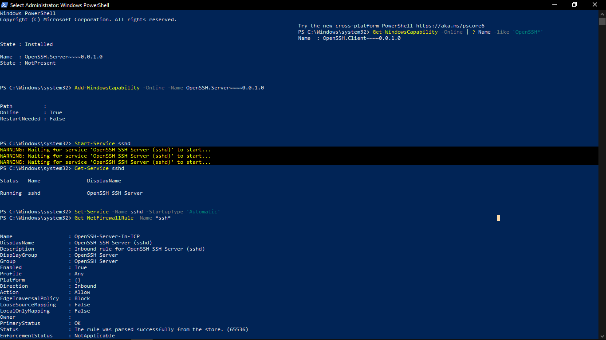
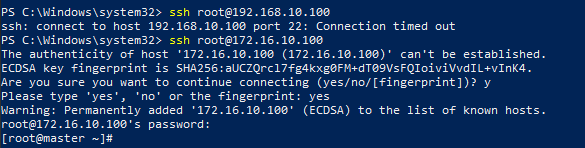

# Tạo Kubernetes Cluster
Tạo ra một Kubernetes Cluster hoàn chỉnh từ 3 máy (3 VPS - hay 3 Server) chạy CentOS:

Hệ thống này gồm:

| Tên máy/Hostname | Thông tin hệ thống  | Vai trò  | 
|---|---|---|
| master.xtl  | HĐH CentOS7, Docker CE, Kubernetes. Địa chỉ IP 172.16.10.100 | master |
| worker1.xtl | HĐH CentOS7, Docker CE, Kubernetes. Địa chỉ IP 172.16.10.101 | worker |
| worker2.xtl | HĐH CentOS7, Docker CE, Kubernetes. Địa chỉ IP 172.16.10.102 | worker |

### Tạo máy Master

