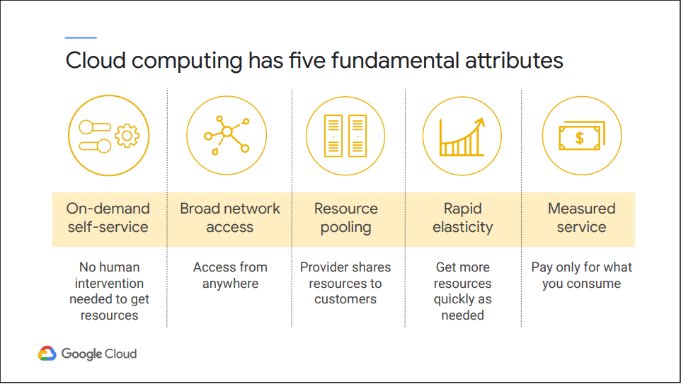
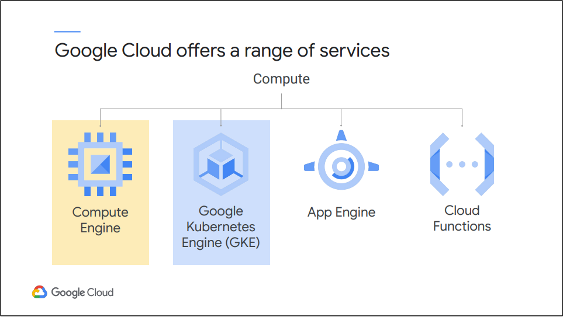
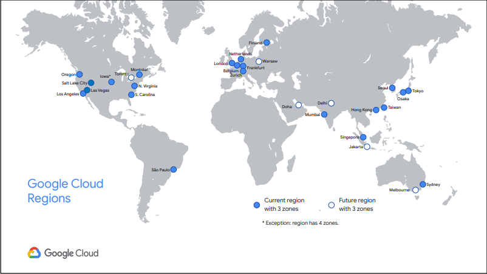
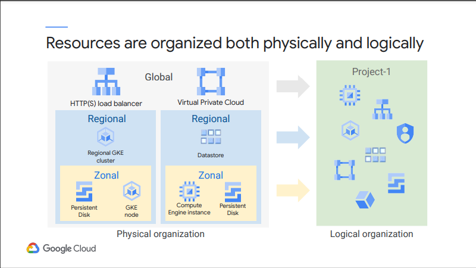
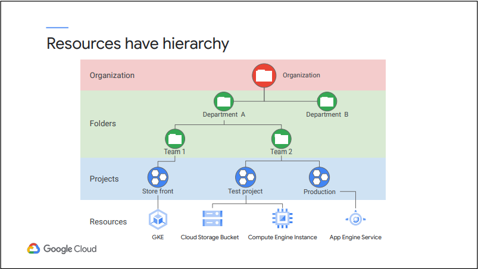
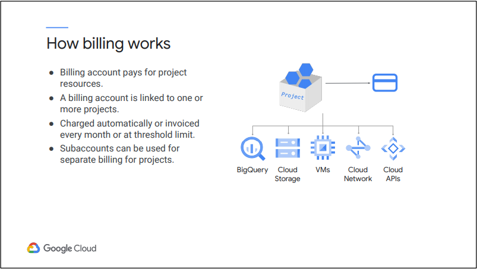
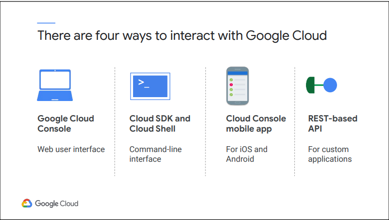

# Module 1: Giới thiệu về Google Cloud

Module đầu tiên này giải thích đơn giản về điện toán đám mây là gì sau đó để chúng ta bắt đầu với các khái niệm. Điện toán đám mây đòi hỏi các tài nguyên được cung cấp cho bạn dưới dạng dịch vụ. Google Cloud cung cấp một số dịch vụ cho phép bạn chạy khối lượng công việc tính toán có mục đích chung trên phần cứng của Google và họ sẽ đáp ứng các dịch vụ đó.

## Cloud Computing và Google Cloud

Điện toán đám mây có năm thuộc tính cơ bản: 

- Tài nguyên máy tính được cung cấp theo yêu cầu (on-demand) và tự phục vụ (self-service). Khách hàng sử dụng dịch vụ điện toán đám mây sẽ sử dụng giao diện tự động và có quyền quản lý, bộ nhớ, mạng mà họ cần mà không cần sự can thiệp của con người. 

- Tài nguyên có thể truy cập qua mạng từ bất kỳ vị trí nào. 

- Các nhà cung cấp phân bổ nguồn lực cho khách hàng từ một nhóm lớn, cho phép họ hưởng lợi từ quy mô kinh tế. Khách hàng không cần phải biết hoặc quan tâm đến vị trí thực tế chính xác của các tài nguyên đó. 

- Nguồn lực có thể co giãn. Những khách hàng cần nhiều tài nguyên hơn có thể nhận được chúng nhanh chóng. Và khi họ cần ít hơn, họ có thể thu nhỏ lại. 

- Cuối cùng, khách hàng chỉ trả tiền cho những gì họ sử dụng hoặc đặt trước, khi họ sử dụng. Nếu họ ngừng sử dụng tài nguyên, họ chỉ đơn giản là ngừng trả tiền.

Đó là cách hoạt động của các Public Cloud như Google Cloud. Google Cloud cung cấp nhiều dịch vụ đám mây khác nhau và người dùng có thể chọn trong số họ để xây dựng giải pháp của mình. Nhiều dịch vụ đám mây trong số này rất quen thuộc, chẳng hạn như máy ảo theo yêu cầu. Các dịch vụ khác đại diện cho một mô hình hoàn toàn mới. Một trong những dịch vụ đó, Google Kubernetes Engine (GKE).

Hình trên đây là tóm tắt nhanh về các dịch vụ của Google Cloud. Dịch vụ có thể phổ biến nhất là Compute Engine, cho phép bạn chạy các máy ảo theo yêu cầu trên đám mây. Đó là giải pháp Cơ sở hạ tầng dưới dạng dịch vụ (Infrastructure-as-a-Service) của Google Cloud. Nó cung cấp tính linh hoạt tối đa cho những người thích tự quản lý các phiên bản máy chủ. 

GKE thì khác. Nó cho phép bạn chạy các ứng dụng được chứa trong một môi trường đám mây mà Google quản lý cho bạn, dưới sự kiểm soát quản trị của bạn. Có thể hiểu về container hóa như một cách để đóng gói mã được thiết kế để mang tính di động cao và sử dụng tài nguyên rất hiệu quả. Trong khi đó Kubernetes như một cách để sắp xếp mã trong các vùng chứa. 

App Engine là khung Nền tảng như một dịch vụ (Platform-as-a-Service) được quản lý hoàn toàn của Google Cloud. Điều đó có nghĩa là đây là một cách để chạy mã trên đám mây mà không phải lo lắng về cơ sở hạ tầng. Bạn chỉ cần tập trung vào mã của mình và để Google giải quyết tất cả việc cấp phép và quản lý tài nguyên.

Cloud Function là một môi trường thực thi hoàn toàn không có máy chủ hay còn gọi là Chức năng như một Dịch vụ (Functions-as-a-Service). Nó thực thi mã của bạn để phản hồi lại các sự kiện, cho dù những sự kiện đó xảy ra một lần một ngày hay nhiều lần mỗi giây. Google phân chia tài nguyên theo yêu cầu, nhưng bạn chỉ trả tiền cho dịch vụ khi mã của bạn được thực thi.

## Quản lý Tài nguyên

Đằng sau các dịch vụ do Google Cloud cung cấp là một loạt tài nguyên khổng lồ của Google Cloud: tài nguyên vật lý, chẳng hạn như máy chủ vật lý và ổ đĩa cứng; Và tài nguyên ảo, chẳng hạn như máy ảo và vùng chứa. Các tài nguyên này được Google quản lý trong các trung tâm dữ liệu toàn cầu của Google. Các trung tâm dữ liệu này được đặt tại 18 khu vực, 55 khu vực và hơn 100 điểm hiện diện trên 35 quốc gia.

Khi bạn tận dụng các dịch vụ và tài nguyên của Google Cloud, bạn có thể chỉ định vị trí địa lý của các tài nguyên đó. Trong nhiều trường hợp, bạn cũng có thể chỉ định xem bạn đang làm như vậy ở cấp khu vực, cấp khu vực hay đa khu vực. Tài nguyên vùng hoạt động trong một vùng duy nhất, có nghĩa là nếu một vùng trở nên không khả dụng, thì các tài nguyên đó cũng sẽ không khả dụng nữa.  

Một ứng dụng sử dụng các tài nguyên này có thể được triển khai dự phòng ở khu vực khác để cải thiện tính khả dụng của nó. Sau đó, bạn sẽ học cách sử dụng GKE để nó có các tài nguyên trải rộng trên các khu vực khác nhau trong một khu vực. Datastore là một dịch vụ Google Cloud khác có thể được triển khai theo cách dự phòng tương tự.

Cuối cùng, các nguồn tài nguyên toàn cầu có thể được quản lý trên nhiều khu vực. Những tài nguyên này có thể cải thiện hơn nữa tính khả dụng của một ứng dụng. Ví dụ về các tài nguyên như vậy bao gồm bộ load balancer HTTPS và mạng Virtual Private Cloud, mà người dùng GKE cũng được hưởng lợi từ đó.

Mỗi dự án được xác định bằng một ID dự án và số dự án duy nhất. Bạn có thể đặt tên cho dự án của mình và áp dụng các nhãn để lọc. Các nhãn này có thể thay đổi, nhưng ID dự án và số dự án vẫn cố định. 

Các dự án có thể thuộc về một “thư mục” là một cơ chế phân cấp khác. Thông thường các doanh nghiệnsử dụng các thư mục để phản ánh hệ thống phân cấp của doanh nghiệp và áp dụng các chính sách ở các cấp phù hợp trong doanh nghiệp. Có thể lồng các thư mục bên trong các thư mục. 

Tổ chức ( organization) là nút gốc của hệ thống phân cấp tài nguyên Google Cloud. Các organization cho phép các doanh nghiện thiết lập các chính sách áp dụng trong toàn bộ doanh nghiệp. Ngoài ra, cần có một tổ chức để sử dụng các thư mục.

Tổ chức sẽ có ID tổ chức cố định và tên hiển thị có thể thay đổi. Hệ thống phân cấp tài nguyên Google Cloud giúp người dùng quản lý tài nguyên trên nhiều phòng ban và nhiều nhóm trong một tổ chức.

Thanh toán trong Google Cloud được thiết lập ở cấp dự án. Khi bạn xác định một dự án Google Cloud, bạn liên kết tài khoản thanh toán với dự án đó. Tài khoản thanh toán này là nơi bạn sẽ định cấu hình tất cả thông tin thanh toán của mình, bao gồm cả tùy chọn thanh toán của bạn. Bạn có thể liên kết tài khoản thanh toán của mình với một hoặc nhiều dự án. Các dự án mà bạn không liên kết với bất kỳ tài khoản thanh toán nào chỉ có thể sử dụng các dịch vụ Google Cloud miễn phí. Tài khoản thanh toán của bạn có thể được tính phí tự động và lập hóa đơn hàng tháng hoặc ở mọi giới hạn ngưỡng. Bạn có thể tách các hóa đơn dự án bằng cách thiết lập các tài khoản phụ thanh toán. Một số khách hàng của Google Cloud bán lại các dịch vụ của Google Cloud sử dụng các tài khoản phụ cho từng khách hàng của riêng họ.

## Tương tác với Google Cloud

Google Cloud Console, Cloud Shell và Cloud SDK, Cloud Console cho ứng dụng di động và các REST-based API là các cách người dùng tương tác với Google Cloud.

Cloud Console là giao diện người dùng đồ họa, dựa trên web, từ đó bạn quản lý các tài nguyên Google Cloud của mình. Nó cho phép bạn thực hiện các tác vụ thông thường bằng cách nhấp chuột đơn giản mà không cần nhớ lệnh hoặc tránh lỗi chính tả. Nó cũng cung cấp khả năng hiển thị vào dự án Google Cloud của bạn và các tài nguyên của nó

Ngoài ra, bạn có thể tải xuống và cài đặt Cloud SDK trên máy tính mà bạn chọn. Cloud SDK chứa một bộ công cụ dòng lệnh cho Google Cloud. Đáng chú ý nhất, nó chứa các lệnh `gcloud` và `kubectl` được sử dụng rất phổ biến  Bạn có thể chạy các công cụ này một cách tương tác hoặc trong các tập lệnh tự động của mình. Cloud SDK cũng chứa các thư viện ứng dụng khách cho các ngôn ngữ lập trình khác nhau.

Cloud Shell cung cấp quyền truy cập dòng lệnh vào tài nguyên đám mây của bạn trực tiếp từ bên trong trình duyệt của bạn. Sử dụng Cloud Shell, bạn có thể quản lý các dự án và tài nguyên của mình một cách dễ dàng mà không cần phải cài đặt Cloud SDK hoặc các công cụ khác cục bộ. Các công cụ dòng lệnh gcloud và kubectl Cloud SDK và các tiện ích khác luôn sẵn có, cập nhật và được xác thực hoàn toàn. Vậy Cloud Shell thực hiện điều đó như thế nào? Nó được xây dựng bằng cách sử dụng bộ chứa docker chạy trên phiên bản máy ảo Compute Engine mà bạn không bị tính phí. Mỗi người dùng Google Cloud có một. Máy ảo Cloud Shell của bạn là tạm thời, có nghĩa là nó sẽ bị dừng bất cứ khi nào bạn ngừng sử dụng tương tác và nó sẽ được khởi động lại khi bạn vào lại Cloud Shell.

Cloud Console dành cho thiết bị di động có sẵn cho iOS và Android. Nó cung cấp nhiều khả năng, chẳng hạn như quản lý máy ảo và xem nhật ký của chúng, nhận thông tin thanh toán cập nhật cho các dự án của bạn và nhận thông báo thanh toán cho các dự án vượt quá ngân sách và thiết lập biểu đồ có thể tùy chỉnh, hiển thị các chỉ số chính như Sử dụng CPU, sử dụng mạng, yêu cầu mỗi giây và lỗi máy chủ. Chúng tôi sẽ không sử dụng nó trong khóa học này, nhưng đó là một tài nguyên mà bạn có thể thấy tiện lợi và tất nhiên là không tính thêm phí.

## Lab 01: Accessing the Google Cloud Console and Cloud Shell

