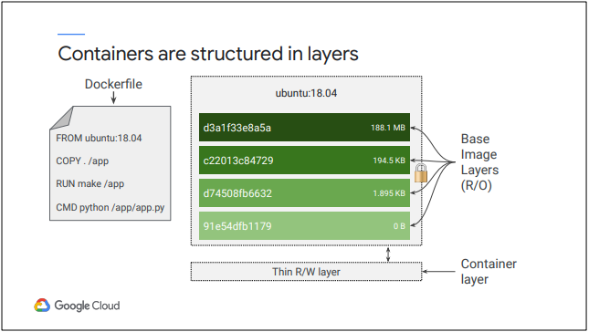
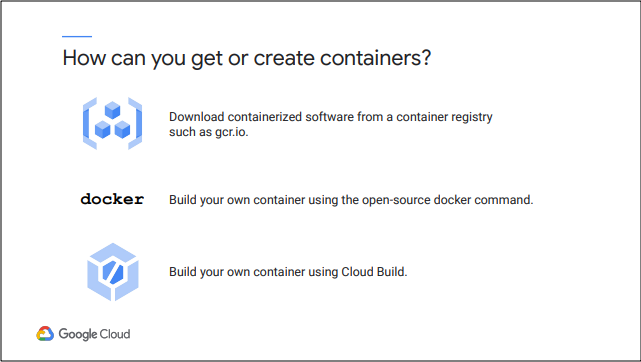
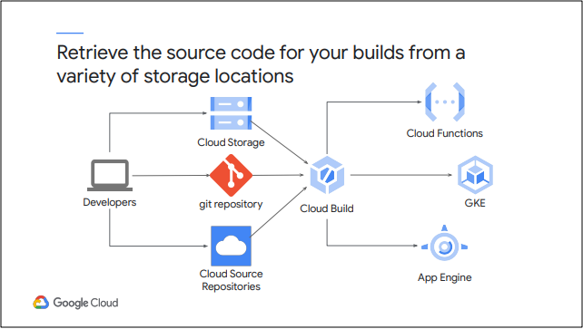
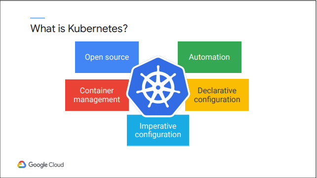
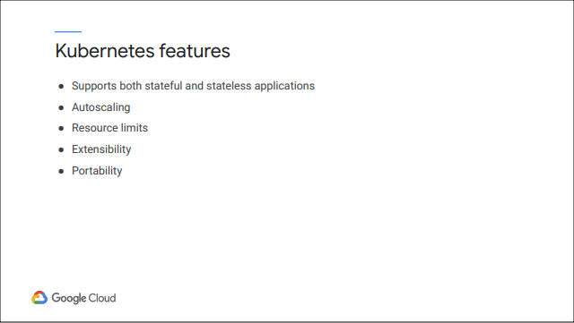
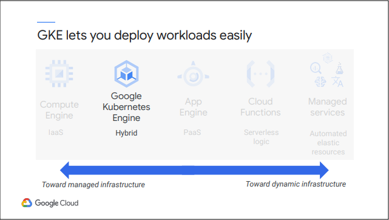
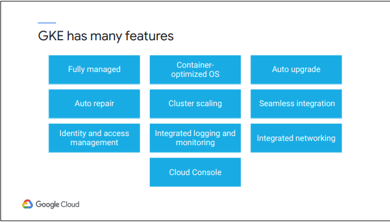

# Module 2: Giới thiệu về Containers and Kubernetes

## Containers

Containers thu hút các nhà phát triển vì chúng là cách tập trung vào ứng dụng để cung cấp các ứng dụng có hiệu suất cao, có thể mở rộng. Containers cũng cho phép các nhà phát triển đưa ra các giả định về phần cứng và phần mềm cơ bản một cách an toàn. Với nhân Linux bên dưới, không cần đến source code hoạt động trên máy tính của mình nhưng vẫn có thể hoạt động trong môi tường product và chạy ở bất cứ đâu. Nếu ta thực hiện các thay đổi đối với Containers dựa trên product Image, ta có thể triển khai nó rất nhanh với một bản sao tệp duy nhất. Điều này giúp tăng tốc độ phát triển đáng kể.

Cuối cùng, các Containers giúp dễ dàng hơn trong việc xây dựng các ứng dụng sử dụng mẫu thiết kế microservices. Điều này cho phép hệ điều hành mở rộng quy mô và nâng cấp các thành phần của ứng dụng mà không ảnh hưởng đến toàn bộ ứng dụng. Một ứng dụng và các phụ thuộc của nó được gọi là một Image. Một Containers chỉ đơn giản là một phiên bản đang chạy của một Image. Bằng cách xây dựng phần mềm thành Images Containers, các nhà phát triển có thể dễ dàng đóng gói và vận chuyển một ứng dụng mà không cần lo lắng về hệ thống mà ứng dụng đang chạy. Ta cần phần mềm để xây dựng Images Containers và chạy chúng. Docker là một công cụ làm được cả hai điều đó. Docker là một công nghệ mã nguồn mở cho phép ta tạo và chạy các ứng dụng trong Containers, nhưng nó không cung cấp cách sắp xếp các ứng dụng đó

Containers không phải là một tính năng nguyên thủy của Linux. Thay vào đó, sức mạnh của chúng để cô lập workloads được bắt nguồn từ thành phần của một số công nghệ. Một nền tảng là quy trình Linux. Mỗi tiến trình Linux có không gian địa chỉ bộ nhớ ảo riêng, tách biệt với tất cả các tiến trình khác, và các tiến trình Linux nhanh chóng được tạo và phá hủy. Containers sử dụng không gian tên Linux để kiểm soát những gì ứng dụng có thể nhìn thấy: số ID xử lý, cây thư mục, địa chỉ IP, v.v. Nhân tiện, không gian tên Linux không giống như không gian tên Kubernetes mà ta sẽ tìm hiểu về phần sau của khóa học này. Các Containers sử dụng các nhóm Linux để kiểm soát những gì một ứng dụng có thể sử dụng: mức tiêu thụ tối đa thời gian CPU, bộ nhớ, băng thông I / O và các tài nguyên khác. Cuối cùng, Containers sử dụng hệ thống tệp liên hợp để đóng gói các ứng dụng và các phần phụ thuộc của chúng vào một tập hợp các lớp tối thiểu, sạch sẽ một cách hiệu quả.

Container Images được cấu trúc theo các lớp. Công cụ ta sử dụng để xây dựng Images đọc hướng dẫn từ một tệp được gọi là “container manifest”. Trong trường hợp Container Images được định dạng Docker, đó được gọi là Dockerfile. Mỗi lệnh trong Dockerfile chỉ định một lớp bên trong Container Images. Mỗi lớp ở chế độ chỉ đọc. (Khi một containers chạy từ Images này, nó cũng sẽ có một lớp trên cùng có thể ghi, tạm thời.) Hãy xem một Dockerfile đơn giản. Dockerfile này sẽ chứa bốn lệnh, mỗi lệnh sẽ tạo ra một lớp. 

 ● Câu lệnh `FROM` bắt đầu bằng cách tạo một lớp cơ sở, được lấy từ một kho lưu trữ công khai. Đây là môi trường thời gian chạy Ubuntu Linux của một phiên bản cụ thể. 

 ● Lệnh `COPY` thêm một lớp mới, chứa một số tệp được sao chép từ thư mục hiện tại của công cụ xây dựng của ta. 
 
 ● Lệnh `RUN` xây dựng ứng dụng của ta bằng lệnh “make” và đưa các kết quả của quá trình xây dựng vào lớp thứ ba. Và cuối cùng, lớp cuối cùng chỉ định lệnh nào sẽ chạy trong containers khi nó được khởi chạy. Mỗi lớp chỉ là một tập hợp các điểm khác biệt so với lớp trước nó. Khi ta viết Dockerfile, ta nên tổ chức từ các lớp ít có khả năng thay đổi nhất, cho đến các lớp có nhiều khả năng thay đổi nhất.

Việc sử dụng container images với mã nguồn mở làm cơ sở cho images của riêng ta hoặc để sử dụng không sửa đổi là rất phổ biến. Ví dụ: ta đã thấy container images với “ubuntu”, tức là môi trường Ubuntu Linux bên trong containers. “Alpine” là một môi trường Linux phổ biến trong một containers. Máy chủ web nginx thường được sử dụng trong đóng gói containers của nó. Google duy trì sổ đăng ký containers, sổ đăng ký này chứa nhiều images công khai, mã nguồn mở và khách hàng của Google Cloud cũng sử dụng nó để lưu trữ images riêng tư của họ theo cách tích hợp với Cloud IAM. Google Container Registry được tích hợp với Cloud IAM, ta có thể sử dụng nó để lưu trữ các images không công khai, chúng là riêng tư đối với dự án của ta. 

Ta cũng có thể tìm thấy container images với Docker Hub Registry, GitLab và những nơi khác. Lệnh open-source docker là một cách phổ biến để xây dựng container images với của riêng tến rộng rãi và phổ biến rộng rãi. Một nhược điểm của việc xây dựng containers bằng lệnh docker là ta phải tin tưởng vào máy tính mà ta thực hiện các bản dựng của mình. Google cung cấp dịch vụ được quản lý để xây dựng các containers được tích hợp với Cloud IAM. Dịch vụ này có tên là Cloud Build và chúng tôi sẽ sử dụng nó trong khóa học này.

Cloud Build có thể truy xuất mã nguồn cho các bản dựng của người dùng từ nhiều vị trí lưu trữ: Cloud Source Repositories, Cloud Storage (là dịch vụ lưu trữ đối tượng của Google Cloud) hoặc các kho lưu trữ tương thích với Git như GitHub và Bitbucket. 

Để tạo một bản dựng bằng Cloud Build, người dùng xác định một loạt các bước. Ví dụ: người dùng có thể định cấu hình các bước xây dựng để tìm nạp các dependencies, compile mã nguồn, chạy integration
tests, hoặc sử dụng các công cụ như Docker, Gradle và Maven. Mỗi bước xây dựng trong Cloud Build chạy trong một Containers Docker. Sau đó, Cloud Build có thể cung cấp các Images mới được xây dựng của người dùng đến các môi trường thực thi khác nhau: không chỉ GKE, mà còn cả App Engine và Cloud Functions.

## Kubernetes

Kubernetes là một nền tảng mã nguồn mở giúp người dùng điều phối và quản lý cơ sở hạ tầng Containers của mình tại chỗ hoặc trên đám mây.

Kubernetes là một môi trường quản lý tập trung vào Containers. Google đã tạo ra nó như một dự án mã nguồn mở. Giờ đây, đó là một dự án của vendor-neutral Cloud Native Computing Foundation.

Kubernetes giúp tự động hóa việc triển khai, mở rộng quy mô, cân bằng tải, ghi nhật ký, giám sát và các tính năng quản lý khác của các ứng dụng được đóng gói. Đây là những tính năng đặc trưng của các giải pháp nền platform-as-a-service điển hình. Kubernetes cũng tạo điều kiện cho các tính năng của platform-as-a-service, chẳng hạn như cho phép nhiều tùy chọn của người dùng và tính linh hoạt của cấu hình. Kubernetes hỗ trợ các cấu hình khai báo. Khi người dùng quản trị cơ sở hạ tầng của mình một cách khai báo, người dùng mô tả trạng thái mong muốn mà người dùng muốn đạt được, thay vì đưa ra một loạt lệnh để đạt được trạng thái mong muốn đó. 

Công việc của Kubernetes là làm cho hệ thống đã triển khai phù hợp với trạng thái mong muốn của người dùng và duy trì nó ở đó bất chấp sự cố. Cấu hình khai báo giúp người dùng tiết kiệm công việc. Bởi vì trạng thái mong muốn của hệ thống luôn được ghi lại, nó cũng làm giảm nguy cơ lỗi.

Kubernetes cũng cho phép cấu hình bắt buộc, trong đó người dùng ra lệnh để thay đổi trạng thái của hệ thống. Một trong những điểm mạnh chính của Kubernetes là khả năng tự động giữ hệ thống ở trạng thái mà người dùng khai báo. Thông thường các quản trị viên Kubernetes có kinh nghiệm chỉ sử dụng cấu hình bắt buộc để khắc phục nhanh các bản sửa lỗi tạm thời và như một công cụ trong việc xây dựng cấu hình khai báo.

Kubernetes hỗ trợ các loại workloads khác nhau. Nó hỗ trợ các ứng dụng không trạng thái, chẳng hạn như máy chủ web Nginx hoặc Apache và các ứng dụng trạng thái nơi dữ liệu người dùng và phiên có thể được lưu trữ liên tục. Nó cũng hỗ trợ các công việc hàng loạt và các tác vụ daemon. 

Kubernetes có thể tự động mở rộng quy mô các ứng dụng được container hóa dựa trên việc sử dụng tài nguyên. Người dùng có thể chỉ định mức yêu cầu tài nguyên và giới hạn tài nguyên cho workloads của mình và Kubernetes sẽ tuân theo chúng. Các kiểm soát tài nguyên này cho phép Kubernetes cải thiện hiệu suất workloads tổng thể trong một Cluster. Các nhà phát triển mở rộng Kubernetes thông qua một hệ sinh thái phong phú gồm các plugin và addon. Ví dụ: hiện có rất nhiều sáng tạo đang diễn ra với Định nghĩa tài nguyên tùy chỉnh của Kubernetes, mang đến mô hình quản lý khai báo Kubernetes cho nhiều thứ khác cần được quản lý. 

Tuy nhiên, trọng tâm chính của khóa học này là bắt đầu với Kubernetes, vì nó được cung cấp như một dịch vụ của Google Cloud, vì vậy việc mở rộng Kubernetes không nằm trong phạm vi của khóa học này.

## Google Kubernetes Engine

Google Cloud cung cấp giải pháp Kubernetes được quản lý được gọi là Google Kubernetes Engine

Google Kubernetes Engine là một dịch vụ Kubernetes được quản lý trên cơ sở hạ tầng của Google. GKE giúp người dùng triển khai, quản lý và mở rộng môi trường Kubernetes cho các ứng dụng chứa trong Google Cloud. Cụ thể hơn, GKE là một thành phần của dịch vụ tính toán Google Cloud. Nó giúp dễ dàng đưa workloads Kubernetes của người dùng lên Cloud.

GKE được quản lý hoàn toàn, có nghĩa là người dùng không phải cung cấp các tài nguyên cơ bản. 

GKE sử dụng hệ điều hành container-optimized để chạy workloads của người dùng. Các hệ điều hành này được Google duy trì và được tối ưu hóa để mở rộng quy mô nhanh chóng với lượng tài nguyên tối thiểu. 

Khi người dùng sử dụng GKE, người dùng bắt đầu bằng khởi tạo hệ thống Kubernetes mới. Hệ thống này được gọi là một Cluster. Tính năng tự động nâng cấp của GKE có thể được bật để đảm bảo rằng các Cluster của người dùng luôn được tự động nâng cấp với phiên bản ổn định mới nhất của Kubernetes. 

Các máy ảo lưu trữ các Containers của người dùng trong một Cluster GKE được gọi là các Node. Nếu người dùng bật tính năng  auto-repair của GKE, dịch vụ sẽ sửa chữa các Node không lành mạnh cho người dùng. Nó sẽ thực hiện kiểm tra tình trạng sức khỏe ( gọi là health) định kỳ trên mỗi Node của Cluster. Nếu một Node được xác định là kunhealthy và cần repair, GKE sẽ ngừng cung cấp tài nguyên cho Node và tạo lại Node mới thay thế. Cũng giống như Kubernetes hỗ trợ mở rộng workloads, GKE hỗ trợ mở rộng chính Cluster.

GKE tích hợp liền mạch với Cloud Build và Container Registry của Google. Điều này cho phép người dùng tự động Deploy bằng cách sử dụng private container images mà người dùng đã lưu trữ an toàn trong Container Registry. 

GKE cũng tích hợp với Identity và Access Management của Google, cho phép người dùng kiểm soát quyền truy cập thông qua việc sử dụng tài khoản và phân quyền theo vai trò. 

Bộ hoạt động của Google Cloud (Google Cloud’s operations suite) là một hệ thống để giám sát và quản lý các services, containers, applications, và cả infrastructure. GKE tích hợp với Cloud Monitoring để giúp người dùng thấy được hiệu suất ứng dụng của mình. 

GKE được tích hợp với Google Virtual Private Clouds và sử dụng các tính năng mạng của Google Cloud. 

Và cuối cùng là Cloud Console cung cấp thông tin chi tiết về các Cluster GKE và tài nguyên của chúng, đồng thời cho phép người dùng xem, kiểm tra và xóa tài nguyên trong các Cluster đó. Kubernetes có chứa một dashboard, nhưng phải mất rất nhiều công sức để thiết lập nó một cách an toàn. Trong khi đó Cloud Console là một trang tổng quan dành cho các Cluster GKE và khối lượng công việc mà người dùng không phải quản lý và nó mạnh mẽ hơn trang Kubernetes dashboard.

