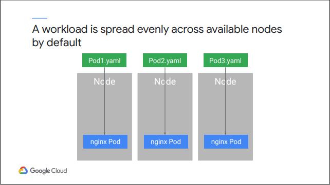

# Module 3: Kiến trúc của Kubernetes

## Kubernetes Concepts

Để hiểu cách hoạt động của Kubernetes, ta cần hiểu hai khái niệm liên quan. 

- Đầu tiên là `Kubernetes object model`. Mỗi thứ Kubernetes quản lý được đại diện bởi một objects và ta có thể xem và thay đổi các thuộc tính và trạng thái của các objects này. 
- Thứ hai là ` principle of declarative management`. Kubernetes yêu cầu người dùng cung cấp trạng thái của các objects mà ta mong muốn dưới sự quản lý của nó là gì, sao đó Kubernetes sẽ hoạt động để đưa trạng thái đó thành hiện thực và giữ nó ở đó.

Mỗi objects thuộc một Kind nhất định (Kind). Các Pods là building block cơ bản của mô hình Kubernetes tiêu chuẩn và chúng là objects Kubernetes nhỏ nhất có thể triển khai. 

Mọi container đang chạy trong hệ thống Kubernetes đều nằm trong Pod. Pod là hiện thân của môi trường nơi các container sống và môi trường đó có thể chứa một hoặc nhiều container. Nếu có nhiều hơn một container trong một Pods, chúng được liên kết chặt chẽ và chia sẻ tài nguyên bao gồm mạng và lưu trữ. Kubernetes gán cho mỗi Pod một địa chỉ IP duy nhất. Mọi container trong Pod đều chia sẻ không gian tên mạng, bao gồm địa chỉ IP và các cổng mạng. Các container trong cùng một Pod có thể giao tiếp thông qua localhost, 127.0.0.1. Một Pod cũng có thể chỉ định một tập hợp các Khối lượng lưu trữ, được chia sẻ giữa các container của nó.

## Kubernetes Components

Đầu tiên và quan trọng nhất, Cluster của Người dùng cần có máy tính. Ngày nay các máy tính soạn Cluster của Người dùng thường là máy ảo. Chúng luôn ở trong GKE, nhưng chúng cũng có thể là máy tính vật lý. Một máy tính như vậy được gọi là `Control Plane` và những máy tính khác được gọi đơn giản là `Node`. Công việc của các Node là chạy Pod. Công việc của Control Plane là điều phối toàn bộ Cluster. Chúng ta sẽ thảo luận về các thành phần Control Plane của nó trước.

Một số thành phần Kubernetes quan trọng chạy trên Control Plane:

- Thành phần duy nhất mà Người dùng tương tác trực tiếp là `kube-apiserver`. Công việc của thành phần này là chấp nhận các lệnh xem hoặc thay đổi trạng thái của Cluster, bao gồm cả việc khởi chạy Nhóm. Người dùng sẽ sử dụng lệnh kubectl thường xuyên; Công việc của lệnh này là kết nối với kube-apiserver và giao tiếp với nó bằng cách sử dụng Kubernetes API. Kube-apiserver cũng xác thực các yêu cầu đến, xác định xem chúng có được ủy quyền và hợp lệ hay không cũng như quản lý kiểm soát nhập học. Nhưng không chỉ kubectl nói chuyện với kube-apiserver. Trên thực tế, bất kỳ truy vấn hoặc thay đổi nào đối với trạng thái của Cluster phải được gửi tới kube-apiserver.

- `Kube-Scheduler` chịu trách nhiệm lập lịch các Pod trên các Node. Để làm được điều đó, nó sẽ đánh giá các yêu cầu của từng Pod riêng lẻ và chọn Node nào phù hợp nhất. Nhưng nó không thực hiện công việc thực sự khởi chạy Pod trên Nodes. Thay vào đó, bất cứ khi nào nó phát hiện ra một objects Pod chưa được gán cho một Node, nó sẽ chọn một Node và chỉ cần ghi tên của Node đó vào objects Pod. 

- Một thành phần khác của hệ thống chịu trách nhiệm khởi chạy các Pod là `Kube-controller-manager`. Làm cách nào để kube-Scheduler quyết định nơi chạy Pod? Nó biết trạng thái của tất cả các Node và nó cũng sẽ tuân theo các ràng buộc mà Người dùng xác định về nơi Pod có thể chạy, dựa trên phần cứng, phần mềm và chính sách. Ví dụ: Người dùng có thể chỉ định rằng một Pod nhất định chỉ được phép chạy trên các Node có một lượng bộ nhớ nhất định. Người dùng cũng có thể xác định các thông số kỹ thuật về sở thích, điều này khiến các nhóm nhóm thích chạy trên cùng một Node; Hoặc thông số kỹ thuật chống mối quan hệ, đảm bảo rằng các nhóm không chạy trên cùng một Node. Người dùng sẽ tìm hiểu thêm về một số công cụ này trong các mô-đun sau. `Kube-controller-manager` có một công việc rộng hơn. Nó liên tục giám sát trạng thái của một Cluster thông qua Kube-APIserver. Bất cứ khi nào trạng thái hiện tại của Cluster không khớp với trạng thái mong muốn, kube-controller-manager sẽ cố gắng thực hiện các thay đổi để đạt được trạng thái mong muốn. Nó được gọi là `controller manager` vì nhiều objects Kubernetes được duy trì bởi các vòng mã được gọi là Controll manager. Các vòng lặp mã này xử lý quá trình khắc phục. Controll manager sẽ rất hữu ích cho Người dùng. Cụ thể, Người dùng sẽ sử dụng một số Kind Controll manager Kubernetes để quản lý khối lượng công việc. Các Kind Controll manager khác có trách nhiệm cấp hệ thống. Ví dụ: công việc của Node Controller là giám sát và phản hồi khi một Node ngoại tuyến. Kube-cloud-manager quản lý các Controll manager tương tác với các nhà cung cấp đám mây cơ bản. Ví dụ: nếu Người dùng khởi chạy một Cluster Kubernetes trên Google Compute Engine theo cách thủ công, kube-cloud-manager sẽ chịu trách nhiệm cung cấp các tính năng của Google Cloud như bộ cân bằng tải và dung lượng lưu trữ khi Người dùng cần.

Mỗi Node cũng chạy một nhóm nhỏ các thành phần control-plane. Ví dụ, mỗi Node chạy một `kubelet`. Người dùng có thể coi kubelet là tác nhân của Kubernetes trên mỗi Node. Khi kube-apiserver muốn bắt đầu một Pod trên một Node, nó sẽ kết nối với kubelet của Node đó. 

`Kubelet` sử dụng runtime của containers để khởi động Pod và theo dõi vòng đời của nó, bao gồm các đầu dò về độ sẵn sàng và độ sống, đồng thời báo cáo lại cho Kube-APIserver. Kubernetes cung cấp một số lựa chọn về runtime containers, nhưng bản phân phối Linux mà GKE sử dụng cho các Node của nó khởi chạy containers bằng containerd, thành phần runtime của Docker. Công việc của `kube-proxy` là duy trì kết nối mạng giữa các Pod trong một cluster.

## Google Kubernetes Engine Concepts

`kubeadm` có thể tự động hóa phần lớn thiết lập ban đầu của một Cluster. Nhưng nếu một node bị lỗi hoặc cần bảo trì, quản trị viên (con người) phải phản hồi theo cách thủ công.

GKE quản lý tất cả các thành phần control-plane cho chúng ta, chịu trách nhiệm cung cấp và quản lý tất cả cơ sở hạ tầng control-plane đằng sau nó. Nó cũng tóm tắt việc có một control-plane riêng biệt. Google Cloud chịu trách nhiệm của control-plane và Người dùng không bị tính phí riêng cho control-plane của mình.

## Object Management

Người dùng xác định các objects mà người dùng muốn Kubernetes tạo và duy trì bằng các tập tin `manifest`. Trên đây là tập tin manifest thông thường. Người dùng có thể viết chúng ở định dạng YAML hoặc JSON. 

`YAML` dễ đọc hơn và dễ dàng chỉnh sửa. Tệp YAML nhưu trên xác định trạng thái mong muốn cho một Pod: tên của nó và một container image cụ thể để nó chạy. 

Tập tin manifest của người dùng có các trường bắt buộc nhất định. `ApiVersion` mô tả phiên bản API Kubernetes nào được sử dụng để tạo objects. Giao thức Kubernetes được tạo phiên bản để giúp duy trì khả năng tương thích ngược. `Kind` xác định objects mà người dùng muốn (trong trường hợp này là Pod) và `Metadata` giúp xác định objects bằng Name, ID duy nhất và Namespace tùy chọn. Người dùng có thể xác định một số objects liên quan trong cùng một tệp YAML và cách tốt nhất là làm như vậy. Một tệp thường dễ quản lý hơn nhiều tệp.

Khi bạn tạo một object Kubernetes, bạn nên đặt tên nó bằng một chuỗi. Tên phải là duy nhất. Chỉ một object của một Kind cụ thể có thể có một tên cụ thể đồng thời trong cùng một Namespace Kubernetes. Tuy nhiên, nếu một object bị xóa, tên của nó có thể được sử dụng lại. Các ký tự chữ và số, dấu gạch nối và dấu chấm được cho phép trong tên, với độ dài ký tự tối đa là 253.

Mọi objects được tạo trong suốt vòng đời của một Cluster đều có một UID duy nhất do Kubernetes tạo ra. Điều này có nghĩa là không có hai objects nào có cùng UID trong suốt vòng đời của một Cluster.

Labels là các cặp key-value mà bạn gắn thẻ các objects của mình trong khi hoặc sau khi tạo. Labels giúp bạn xác định và tổ chức các objects và tập hợp con của các objects. Ví dụ: bạn có thể tạo một Labels có tên là “app” và cung cấp giá trị của nó là app mà objects này là một phần. Trong ví dụ đơn giản này, một objects Pod được gắn Labels với ba key-value khác nhau: app của nó, môi trường của nó và ngăn xếp mà nó tạo thành một phần. Các ngữ cảnh khác nhau cung cấp các cách để chọn tài nguyên Kubernetes theo Labels của chúng. Trên đây là một ví dụ về việc sử dụng nó để hiển thị tất cả các nhóm có chứa Labels gọi là “app” với giá trị là “nginx”. Bạn có thể yêu cầu tất cả các tài nguyên có giá trị nhất định cho một Labels, tất cả những tài nguyên không có giá trị nhất định hoặc thậm chí tất cả những tài nguyên có giá trị trong bộ mà bạn cung cấp.

Một cách để đưa ba máy chủ web nginx ra đời là khai báo ba objects Pod, mỗi objects có phần YAML riêng của nó. Thuật toán lập lịch mặc định của Kubernetes trải đều workloads trên các node có sẵn cho nó.

Pod không tự repair và không chạy mãi mãi được. Chúng được thiết kế để sử dụng một lần. Vì những lý do này, có nhiều cách tốt hơn để quản lý những gì bạn chạy trong Kubernetes hơn là chỉ định các Pod riêng lẻ. Bạn cần thiết lập như vậy để duy trì tính khả dụng cao của ứng dụng cùng với việc mở rộng quy mô theo chiều ngang. Thay vào đó, chúng ta có thể khai báo một đối tượng controller có công việc là quản lý trạng thái của các Pod. Một số ví dụ về các đối tượng này: Deployments, StatefulSets, DaemonSets và Jobs như bên dưới:

