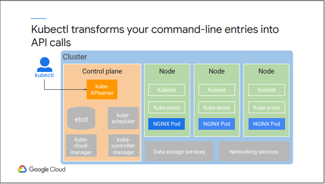
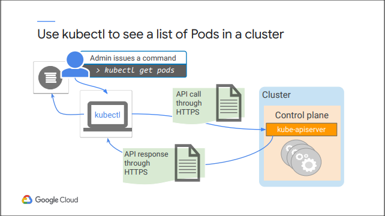
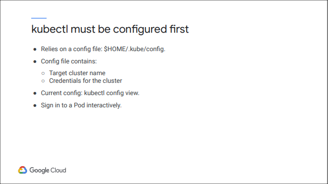
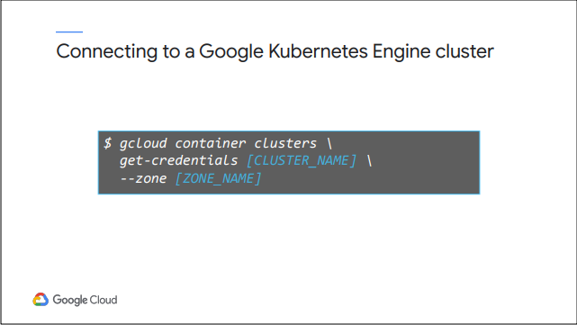
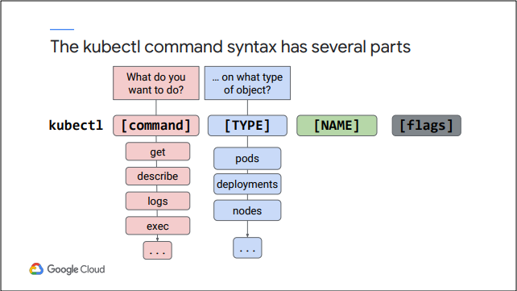
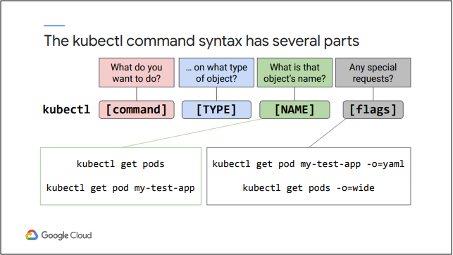
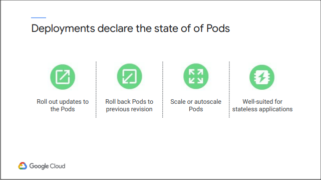
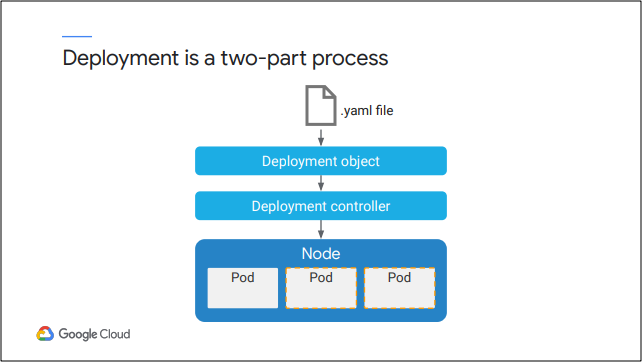
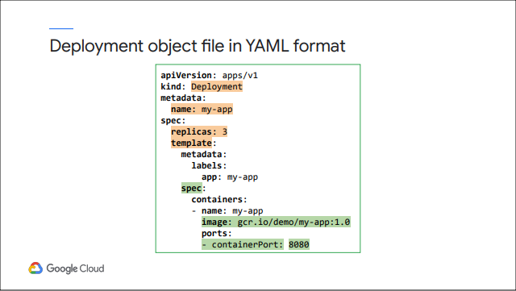

# Module 4: Giới thiệu về Kubernetes Workloads

## kubectl

`Kubectl` là một tiện ích cung cấp cho quản trị viên sử dụng để kiểm soát các Kubernetes Cluster. Ta sẽ sử dụng nó để giao tiếp với máy chủ Kube API trên control-plane của mình.

`Kubectl` chuyển đổi các command-line entries của người dùng thành các lệnh gọi API mà nó gửi đến máy chủ Kube API trong Kubernetes Cluster đã chọn của người dùng. Trước khi nó có thể thực hiện bất kỳ công việc nào cho người dùng, kubectl phải được định cấu hình với vị trí và thông tin đăng nhập của một Kubernetes Cluster.

Ví dụ: đưa một quản trị viên muốn xem danh sách các Pods trong một Cluster. Sau khi kết nối kubectl với Cluster bằng thông tin đăng nhập phù hợp, quản trị viên có thể đưa ra lệnh `kubectl get pods`. Kubectl chuyển đổi command line này thành một lệnh gọi API, nó sẽ gửi đến máy chủ API Kube thông qua HTTPS trên máy chủ control-plane của Cluster. Máy chủ Kube API xử lý yêu cầu bằng cách truy vấn `etcd`. Máy chủ Kube API sau đó trả kết quả về kubectl thông qua HTTPS. Cuối cùng, kubectl diễn giải phản hồi API và hiển thị kết quả cho quản trị viên tại `command prompt`.

Trước khi người dùng có thể sử dụng kubectl để định cấu hình cluster của mình, người dùng phải định cấu hình cho nó trước. Kubectl lưu trữ cấu hình của nó trong một tệp nằm trong thư mục chính của người dùng trong một thư mục ẩn có tên `.kube`. Tệp cấu hình chứa danh sách các cluster và thông tin xác thực mà người dùng sẽ sử dụng để đính kèm vào từng cluster đó. 

Đối với GKE, dịch vụ cung cấp chúng cho người dùng thông qua lệnh `gcloud`. Để xem cấu hình, người dùng có thể mở tệp cấu hình hoặc sử dụng lệnh `kubectl config view`. Chế độ xem cấu hình kubectl cho người dùng biết về cấu hình của chính lệnh kubectl. Các lệnh kubectl khác cho người dùng biết về cấu hình của cluster và workloads của người dùng.

Để kết nối với một cluster GKE bằng kubectl, trước tiên hãy truy xuất thông tin đăng nhập của người dùng của cluster được chỉ định. Dùng lệnh `gcloud get-credentials` trong bất kỳ môi trường nào khác mà người dùng đã cài đặt công cụ dòng lệnh `gcloud` và `kubectl`. Cả hai công cụ này đều được cài đặt theo mặc định trong Cloud Shell. 

Lệnh `gcloud get-credentials` ghi thông tin cấu hình vào tệp cấu hình trong thư mục `.kube` trong thư mục `$ HOME` theo mặc định. Nếu người dùng chạy lại lệnh này cho một cluster khác, nó sẽ cập nhật tệp cấu hình với thông tin đăng nhập cho cluster mới. người dùng chỉ cần thực hiện quá trình cấu hình này một lần cho mỗi cluster trong Cloud Shell của mình, vì thư mục `.kube` và nội dung của nó nằm trong thư mục `$ HOME` của người dùng. Sự kahsc biệt giữa `gcloud get-credentials` và `kubectl get-credentials` là lệnh `kubectl` yêu cầu thông tin đăng nhập để hoạt động trong khi lệnh `gcloud` là cách người dùng được ủy quyền tương tác với Google Cloud từ dòng lệnh. Lệnh `get-credentials` của `gcloud` cung cấp cho người dùng thông tin xác thực người dùng cần để kết nối với một GKE cluster nếu người dùng được phép làm như vậy. 

Nói chung, kubectl là một công cụ để quản lý state bên trong của một cluster hiện có. Nhưng kubectl không thể tạo các cluster mới hoặc thay đổi hình dạng của các cluster hiện có; Vì điều đó, người dùng cần GKE control-plane, mà lệnh gcloud và Cloud Console là giao diện của người dùng.

Khi tệp cấu hình trong thư mục `.kube` được định cấu hình, lệnh `kubectl` sẽ tự động tham chiếu tệp này và kết nối với cluster mặc định mà không cần nhắc người dùng về thông tin đăng nhập. Cú pháp của nó bao gồm một số phần: `command`, `type`, `name`, và `optional flags`

- `COMMAND` chỉ định hành động mà người dùng muốn thực hiện, chẳng hạn như get, description, log, hoặc execute. Một số lệnh hiển thị cho người dùng thông tin, trong khi các lệnh khác cho phép người dùng thay đổi cấu hình của cluster. 

- `TYPE` xác định objects Kubernetes mà `command` hoạt động. Ví dụ: người dùng có thể chỉ định Pods, Deployments, Nodes hoặc các objects khác, bao gồm cả chính cluster. `type` được sử dụng kết hợp với `command` cho `kubectl` biết người dùng muốn làm gì và loại objects người dùng muốn thực hiện hành động đó.

- `NAME` chỉ định objects được xác định trong `TYPE`. Feild `name` không phải lúc nào cũng cần thiết, đặc biệt khi người dùng đang sử dụng các lệnh liệt kê hoặc hiển thị thông tin cho người dùng. Ví dụ: nếu người dùng chạy lệnh `kubectl get pods` mà không chỉ định tên, lệnh sẽ trả về danh sách tất cả các Pods. Để lọc danh sách này, người dùng chỉ định tên của Pod, chẳng hạn như `kubectl get pod my-test-app`. `Kubectl` sau đó chỉ trả về thông tin trên Pod có tên là `my-test-app`. 

- Một số lệnh hỗ trợ các `flags` tùy chọn bổ sung mà người dùng có thể đưa vào ở cuối lệnh. Người dùng có thể xem state của Pod bằng cách sử dụng lệnh `kubectl get pod my-test-app -o = yaml`. 

`Kubectl` cung cấp cho người dùng đầu ra ở định dạng YAML, chính điều này là một công cụ thực sự hữu ích. Người dùng thường sẽ muốn ghi lại state hiện có của objects Kubernetes trong tệp YAML, ví dụ trường hợp người dùng có thể tạo lại nó trong một cluster khác. Người dùng cũng có thể sử dụng `flags` để hiển thị nhiều thông tin hơn người dùng thường thấy. Ví dụ: người dùng có thể chạy lệnh `kubectl get pods -o = wide` để hiển thị danh sách Pods ở định dạng `wide`, có nghĩa là người dùng thấy các cột dữ liệu bổ sung cho từng Pods trong danh sách. Một thông tin bổ sung thêm đáng chú ý mà người dùng nhận được ở định dạng `wide` là thông tin Nodes mà mỗi Pod đang chạy.

## Deployments

Deployments mô tả desired state của Pods. Ví dụ: desired state có thể là người dùng muốn đảm bảo rằng 5 Pods nginx luôn chạy thì deployments sẽ được khai báo với Kubernetes là sẽ liên tục đảm bảo cấu hình đang chạy trên cluster đúng với những gì khai báo từ trước.

Mỗi khi bạn cập nhật thông số kỹ thuật của Pods, một ReplicaSet mới sẽ được tạo phù hợp với phiên bản đã thay đổi của Deployments. Đây là cách Deployments Deploymentsi các Pods cập nhật theo cách có kiểm soát: các Pods cũ từ ReplicaSet cũ được thay thế bằng các Pods mới hơn trong một ReplicaSet mới. Nếu các Pods được cập nhật không ổn định, quản trị viên có thể khôi phục Pods về bản sửa đổi Deployments trước đó. 

Bạn có thể mở rộng các Pods theo cách thủ công bằng cách sửa đổi cấu hình Deployments. Bạn cũng có thể định cấu hình Deployments để quản lý khối lượng công việc một cách tự động. Các Deployments được thiết kế cho các ứng dụng `not stable`. Các ứng dụng `not stable` không lưu trữ dữ liệu hoặc state ứng dụng vào một cụm hoặc vào bộ nhớ liên tục. Một ví dụ điển hình của ứng dụng `not stable` là giao diện người dùng Web. Một số chương trình phụ trợ gặp phải vấn đề trong việc đảm bảo rằng dữ liệu được lưu trữ lâu dài và bạn sẽ sử dụng các đối tượng Kubernetes khác với Deployments để quản lý các kết thúc phía sau này.

Desired state được mô tả trong tệp YAML Deployments chứa các đặc điểm của các Pods, cùng với cách vận hành các Pods này một cách hoạt động và xử lý các sự kiện trong vòng đời của chúng. Sau khi bạn gửi tệp này đến Kubernetes control-plane, nó sẽ tạo ra một Deployments Controller, có nhiệm vụ chuyển đổi desired state thành hiện thực và giữ desired state đó theo thời gian. (Controller là một quy trình lặp do Kubernetes tạo ra nhằm đảm bảo các tác vụ thường xuyên để đảm bảo desired state của một đối tượng hoặc một tập hợp các đối tượng, chạy trên cụm khớp với state được quan sát). Trong quá trình này, một ReplicaSet được tạo. ReplicaSet là Controller đảm bảo rằng một số bản sao Pod nhất định đang chạy tại bất kỳ thời điểm nào. Deployments là Controller cấp cao cho Pod khai báo state của nó. Deployments định cấu hình Controller ReplicaSet để khởi tạo và duy trì một phiên bản cụ thể của các Pods được chỉ định trong Deployments

Trên đây là một ví dụ đơn giản về tập tin cấu hình cho objest Deployments ở định dạng YAML. Deployments tên là `my-app` được tạo với 3 replicated Pods. 

Trong phần `spec.template`, một template cho các Pod xác định metadata và thông số kỹ thuật của từng Pod trong ReplicaSet này. Trong thông số kỹ thuật của Pod, một Image được lấy từ Google Container Registry và cổng 8080 được hiển thị để gửi và chấp nhận lưu lượng truy cập cho container.

