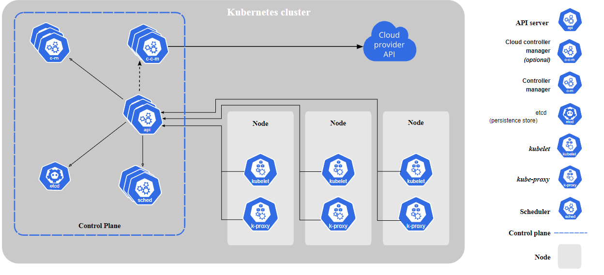

# I. Understand the basics concepts
## 1. Tổng quan về Kubernetes

Kubernetes là một nền tảng nguồn mở, khả chuyển, có thể mở rộng để quản lý các ứng dụng được đóng gói và các service, giúp thuận lợi trong việc cấu hình và tự động hoá việc triển khai ứng dụng. Kubernetes là một hệ sinh thái lớn và phát triển nhanh chóng. Các dịch vụ, sự hỗ trợ và công cụ có sẵn rộng rãi.

### 1.1 Lợi ích của Kubernetes

Kubernetes cung cấp cho người dung:

  •	**Service discovery và cân bằng tải:**
  Kubernetes có thể expose một container sử dụng DNS hoặc địa chỉ IP của riêng nó. Nếu lượng traffic truy cập đến một container cao, Kubernetes có thể cân bằng tải và phân phối lưu lượng mạng (network traffic) để việc triển khai được ổn định.
  
  •	**Điều phối bộ nhớ:**
  Kubernetes cho phép khả năng tự động mount một hệ thống lưu trữ mà người dùng có thể chọn, như local storages, public cloud providers, v.v.
  
  •	**Tự động rollouts và rollbacks:**
  Người dùng có thể mô tả trạng thái mong muốn cho các container được triển khai dùng Kubernetes và nó có thể thay đổi trạng thái thực tế sang trạng thái mong muốn với tần suất được kiểm soát. Ví dụ ta có thể tự động hoá Kubernetes để tạo mới các container cho việc triển khai của mình hoặc xoá các container hiện có và áp dụng tất cả các resource của chúng vào container mới.
  
  •	**Đóng gói tự động:**
  Một Kubernetes cluster gồm các node mà nó có thể sử dụng để chạy các tác vụ được đóng gói (containerized task). Khi đó Kubernetes sẽ được biết mỗi container cần bao nhiêu CPU và bộ nhớ (RAM). Kubernetes có thể điều phối các container đến các node để tận dụng tốt nhất các tài nguyên hiện có.
  
  •	**Tự phục hồi:**
  Kubernetes khởi động lại các containers bị lỗi, thay thế các container, xoá các container không phản hồi lại cấu hình health check do người dùng xác định và không cho các client biết đến chúng cho đến khi chúng sẵn sàng hoạt động.
  
  •	**Quản lý cấu hình và bảo mật:**
  Kubernetes cho phép ta lưu trữ và quản lý các thông tin nhạy cảm như: password, OAuth token và SSH key. Ta có thể triển khai và cập nhật lại secret và cấu hình ứng dụng mà không cần build lại các container image và không để lộ secret trong cấu hình stack của mình.

### 1.2 Kubernetes Components
Một Kubernetes cluster bao gồm các thành phần đại diện cho control plane và một tập hợp các máy được gọi là các Node, hay còn gọi là các máy worker.

Các máy worker lưu trữ các Pods như là thành phần của application workload. Trong khi đó, nút control plaane quản lý các nút worker và các Pods trong Cluster. Trong môi trường production, control plane thường chạy trên nhiều máy tính và một cluster thường chạy nhiều nút mang lại khả năng chịu lỗi và tính sẵn sàng cao.

Đây là sơ đồ của một cụm Kubernetes với tất cả các thành phần được gắn với nhau.

Trong sơ đồ trên, các Kubernetes Components có thể chia làm 3 phần chính bao gồm:

#### 1.2.1 Control Plane Components
kube-apiserver

etcd

kube-scheduler

kube-controller-manager

cloud-controller-manager

#### 1.2.2 Node Components
kubelet

kube-proxy

container runtime

#### 1.2.3 Addons
DNS

Web UI (Dashboard)

Container Resource

Monitoring

Cluster-level Logging

### 1.3 Kubernetes API

Kubernetes API cho phép bạn truy vấn và thao tác với trạng thái của các đối tượng trong Kubernetes. Cốt lõi của control plane trong Kubernetes là máy chủ API và API HTTP mà nó hiển thị. Người dùng, các thành phần khác nhau trong cluster và các thành phần bên ngoài đều giao tiếp với nhau thông qua máy chủ API.

### 1.4. Kubernetes Objects

Các đối tượng Kubernetes là các thực thể liên tục trong hệ thống Kubernetes. Kubernetes sử dụng các thực thể này để đại diện cho trạng thái cụm của bạn. 

