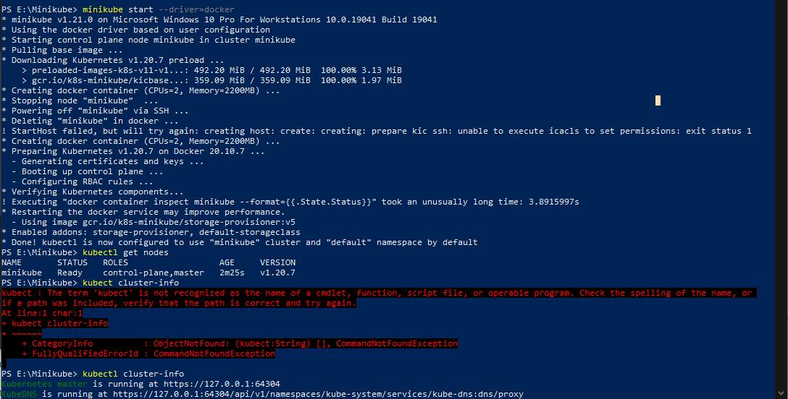
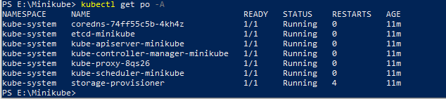
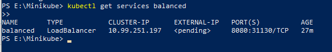

# Launch Single Node Kubernetes Cluster

## Step 1 - Khởi động Minikube
Cài đặt dựa trên hướng dẫn của [minikube](https://minikube.sigs.k8s.io/docs/start/). Do máy mình không đủ dung lượng ổ cứng để cài minikube cùng với các VM tools nên sẽ thực hành trên katacoda.

- Kiểm tra xem Minikube đã được cài đặt đúng cách chưa bằng cách chạy lệnh kiểm tra phiên bản minikube: `minikube version`

- Khởi động cluster bằng cách chạy lệnh minikube start: `minikube start --wait=false`

Kubernetes cluster đang chạy trên terminal. Minikube đã khởi động một máy ảo và một Kubernetes Cluster hiện đang chạy trong máy ảo đó.

## Step 2 - Xem thông tin Kubernetes Cluster
Ta có thể tương tác với Kubernetes Cluster bằng cách sử dụng kubectl CLI. Đây là cách tiếp cận chính được sử dụng để quản lý Kubernetes và các ứng dụng chạy trên cùng Kubernetes Cluster. 

- Để xem thông tin chi tiết của Kubernetes Cluster, ta chạy lệnh: `kubectl cluster-info`

- Để xem thông tin tất cả các node trong cluster:  `kubectl get nodes`

Nếu nút được đánh dấu là NotReady thì nó vẫn đang khởi động các components.

## Step 3 - Deploy Containers
Khi một Kubernetes cluster đang chạy, các containers trong đó có thể deploy bằng cách sử dụng câu lệnh kubectl run như sau: `kubectl create deployment first-deployment --image=katacoda/docker-http-server`

Câu lệnh trên khởi động một deployment có các containers dựa trên image katacoda/docker-http-server.

Để xxem trạng thái của các Pod ta sử dụng lệnh: `kubectl get pods`

Khi một container đang chạy nó có thể được hiển thị thông qua các tùy chọn networks khác nhau tùy thuộc vào requirements. Ta có thể sử dụng NodePort để cung cấp một port cụ thể cho container bằng câu lệnh:

`kubectl expose deployment first-deployment --port=80 --type=NodePort`

Lệnh bên dưới tìm port được cấp phát và thực hiện một HTTP request.

`
export PORT=$(kubectl get svc first-deployment -o go-template='{{range.spec.ports}}{{if .nodePort}}{{.nodePort}}{{"\n"}}{{end}}{{end}}')
echo "Accessing host01:$PORT"
curl host01:$PORT
`

Kết quả là container xử lý HTTP request và trả về một html với thẻ h1 như sau:

`<h1>This request was processed by host: first-deplotment-666c48b44-vfw8s<h1>`

## Step 4 - Dashboard

Khởi động Kubernetes Dashboard bằng Minikube với lệnh `minikube addons` Hoặc triển khai một file cấu hình YAML như sau.

`kubectl apply -f /opt/kubernetes-dashboard.yaml` ( chạy trên katacoda - cổng mặc đọnh là 30000)
  
Kubernetes dashboard cho phép ta xem các ứng dụng của mình qua UI. Để xem các pod đang chạy ta sử dụng lệnh:
  `kubectl get pods -n kubernetes-dashboard -w`
Sau khi chạy Kubernetes dashboard trên katacoda, URL đến trang dashboard là: https://2886795278-30000-ollie08.environments.katacoda.com/
  
 Dưới đây là giao diện dashboard với thông tin các pod đang chạy:
  
  
   

# Launch Single Node Kubernetes Cluster - minikube start
## Step 1, 2: Khởi động Minikube và Xem thông tin Kubernetes Cluster

Cài đặt dựa trên hướng dẫn của minikube.

Khởi động cluster bằng cách chạy lệnh minikube start với driver là Docker: `minikube start --driver=docker`

Ta có thể tương tác với Kubernetes Cluster bằng cách sử dụng kubectl CLI. Đây là cách tiếp cận chính được sử dụng để quản lý Kubernetes và các ứng dụng chạy trên cùng Kubernetes Cluster.

Để xem thông tin chi tiết của Kubernetes Cluster, ta chạy lệnh: `kubectl cluster-info`

Để xem thông tin tất cả các node trong cluster: `kubectl get nodes`

Truy cập tới Cluster vừa tạo: `kubectl get po -A`. Kết quả như sau:

Ban đầu, một số service chẳng hạn như trình cung cấp bộ nhớ có thể chưa ở trạng thái Running. Đây là tình trạng bình thường trong quá trình khởi động Cluster và sẽ được tự giải quyết trong giây lát. Để có thêm thông tin chi tiết về trạng thái của Cluster, minikube cung cấp một package Kubernetes Dashboard, cho phép ta dễ dàng làm quen, tiếp cận với môi trường mới của mình:

## Step 4 - Deploy Containers
Tạo một Depoloyment và hiển thị nó trên Port 8080:
`kubectl create deployment hello-minikube --image=k8s.gcr.io/echoserver:1.4` , sau đó chạy lệnh `kubectl expose deployment hello-minikube --type=NodePort --port=8080`
Đợi xíu cho tới khi tạo deployment xong, ta sử dụng lệnh `kubectl get services hello-minikube
` để truy cập đến service để minikube tự khởi chạy ứng dụng trên trình duyệt mặc định:

Sử dụng kubectl để chuyển tiếp cổng: `kubectl port-forward service/hello-minikube 7080:8080`.  Ứng dụng đã có thể chạy trên cổng 7080 như bên dưới:

Để truy cập LoadBalancer deployment ta sử dụng lệnh “minikube tunel”. Đây là một ví dụ:

`kubectl create deployment balanced --image=k8s.gcr.io/echoserver:1.4`

`kubectl expose deployment balanced --type=LoadBalancer --port=8080`

Mở một cửa sổ mới và chạy câu lệnh `minikube tunel` để tạo một IP có thể định tuyến cho việc LoadBalancer deployment:

Để tìm IP có thể định tuyến ta chạy lệnh `kubectl get services balanced` và xem ở cột EXTERNAL-IP:

Ứng dụng bây giờ đang được triển khai dưới cổng ` <EXTERNAL-IP>:8080`

## Manage your cluster

Ta có thể dừng Kubernetes với câu lệnh `minikube stop` và sau đó xóa minikube cluster với câu lệnh `minikube delete`:

