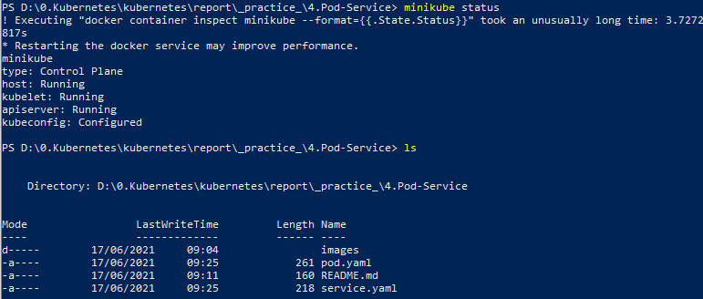
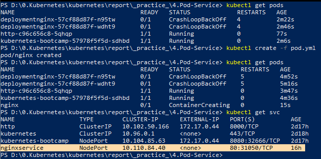
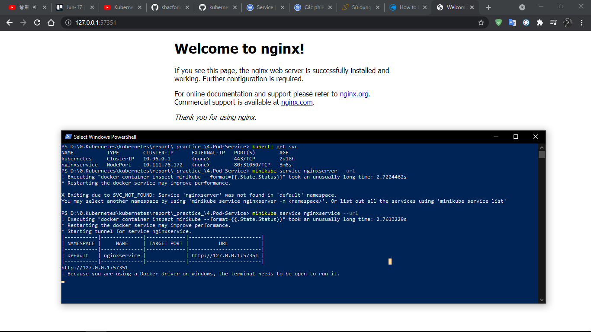
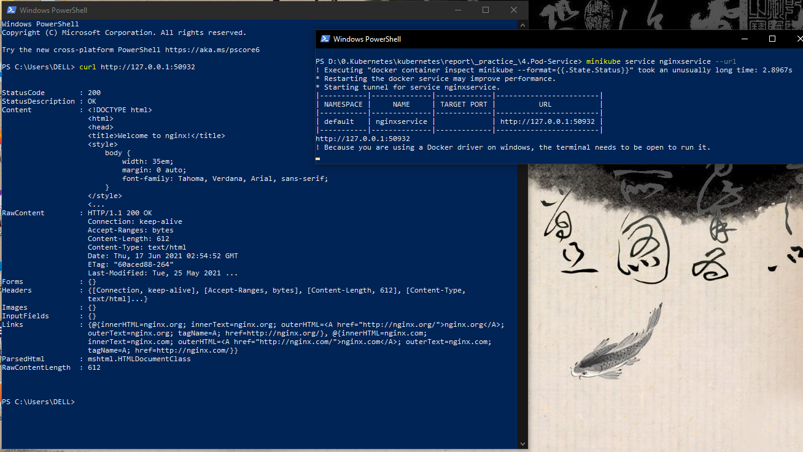

# Kubernetes Pods
Khi người dùng triển khai ứng dụng của họ, Kubernetes tạo ra Pod để lưu trữ phiên bản chạy của ứng dụng đó. Pod là một khái niệm trừu tượng trong Kubernetes, đại diện cho một nhóm gồm một hoặc nhiều ứng dụng containers (ví dụ như Docker hoặc rkt) và một số tài nguyên được chia sẻ cho các containers đó. Những tài nguyên đó bao gồm:
  - Lưu trữ được chia sẻ, dưới dạng Volumes
  - Kết nối mạng, như một cluster IP duy nhất
  - Thông tin về cách chạy từng container, chẳng hạn như phiên bản container image hoặc các ports cụ thể để sử dụng

Một Pod mô phỏng một "máy chủ logic" dành riêng cho ứng dụng và có thể chứa các ứng dụng containers khác nhau được liên kết tương đối chặt chẽ. Ví dụ, một Pod có thể bao gồm cả container với ứng dụng Node.js cũng như một container khác cung cấp dữ liệu hiển thị bởi webserver của Node.js. Các containers trong một Pod chia sẻ một địa chỉ IP và port space, chúng luôn được đặt cùng vị trí, cùng lên lịch trình, và chạy trong ngữ cảnh được chia sẻ trên cùng một Node.

Pods là các đơn vị nguyên tử trên nền tảng Kubernetes. Khi chúng tôi tạo một kịch bản triển khai (Deployment) trên Kubernetes, kịch bản triển khai đó tạo ra các Pods với các containers bên trong chúng (trái ngược với việc tạo các containers trực tiếp). Mỗi Pod được gắn với Node nơi nó được lên lịch trình, và tiếp tục ở đó cho đến khi chấm dứt (theo chính sách khởi động lại). Trong trường hợp có lỗi ở Node, các Pods giống nhau được lên lịch trình trên các Nodes có sẵn khác trong cluster.

# Kubernetes Service

Các Pod được quản lý trong Kubernetes, trong vòng đời của nó chỉ diễn ra theo hướng _được tạo ra, chạy_ và khi nó _kết thúc_ thì bị _xóa_ và _khởi tạo POD mới thay thế_. Có nghĩa ta không thể có tạm dừng POD, chạy lại POD đang dừng ...

Mặc dù mỗi POD khi tạo ra nó có một IP để liên lạc, tuy nhiên vấn đề là mỗi khi POD thay thế thì là một IP khác, nên các dịch vụ truy cập không biết IP mới nếu ta cấu hình nó truy cập đến POD nào đó cố định. Để giải quết vấn đề này sẽ cần đến Service.

Service (micro-service) là một đối tượng trừu tượng nó xác định ra một nhóm các POD và chính sách để truy cập đến POD đó. Nhóm cá POD mà Service xác định thường dùng kỹ thuật Selector (chọn các POD thuộc về Service theo label của POD).

Cũng có thể hiểu Service là một dịch vụ mạng, tạo cơ chế cân bằng tải (load balancing) truy cập đến các điểm cuối (thường là các Pod) mà Service đó phục vụ.

# Thực hành
**Mục tiêu:** Định nghĩa Service trong Kubernetes

- Tạo Nginx pod sử dụng manifest yaml file

- Tạo Service sử dụng Service manifest file và selector.

## Bước 1: Khởi động Kubernetes cluster
Khởi động kubernetes cluster, trong đó gồm hai file manifest yaml: [pod.yml](pod.yml) và [service.yml](service.yml) được cấu hình sẵn theo hướng dẫn của [pod-service-manifest-yaml](https://github.com/shazforiot/pod-service-manifest-yaml):

Ta định nghĩa 1 Pod chứa 1 Container `nginxwebport` chạy ở cổng `80` với giao thức `TCP`, Pod này có label app là nginx. Và một Service tương ứng có selector trùng với Pod là `nginx`. type của Service này là NodePort, sử dụng giao thức TCP chạy trên cổng 80 và nodePort là 31050, targetPort đến `nginxwebport` của Pod.

## Bước 2: Sử dụng Pod và Service dựa trên cấu hình yaml

`kubectl create -f pod.yml`

` kubectl create -f service.yml`

Dùng lệnh `minikube service nginxservice --url `, ta sẽ có được url của Service, mở trình duyệt lên và truy cập đến Nginx Server từ url đó, kết quả như sau:

Khi Nginx đang chạy, ta có thể ping tới địa chỉ đó bằng `curl` như sau:

