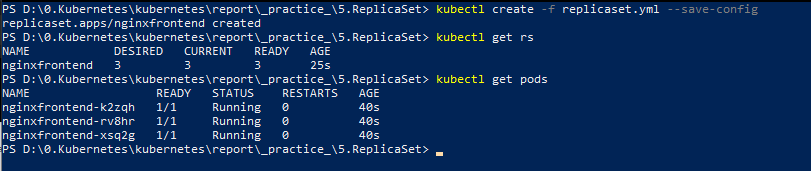
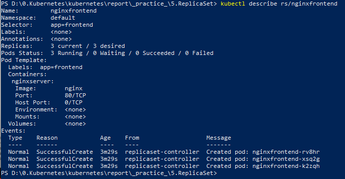
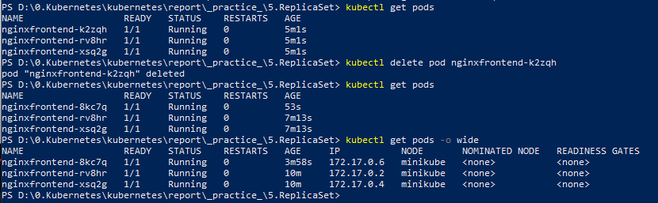

# ReplicaSet

[ReplicaSet](https://kubernetes.io/docs/concepts/workloads/controllers/replicaset/) là một điều khiển Controller - nó đảm bảo ổn định các nhân bản (số lượng và tình trạng của POD, replica) khi đang chạy. Mục đích của ReplicaSet là duy trì một tập hợp các bản sao của Pod có thể chạy ổn định tại bất kỳ thời điểm nào. Do đó nó thường được sử dụng để đảm bảo tính khả dụng của một số lượng Pods giống hệt nhau.

Một ReplicaSet được định nghĩa bằng các fields, bao gồm một bộ selector chỉ định cách xác định các Pods mà ReplicaSet có thể gom lại được, một số replicas cho biết nó sẽ duy trì bao nhiêu Pod và một pod template chỉ định dữ liệu của các Pod mới mà nó sẽ tạo để đáp ứng số lượng của tiêu chí nhân bản. Sau đó, một ReplicaSet thực hiện mục đích của nó bằng cách tạo và xóa các Pod nếu cần để đạt được số lượng mong muốn. Khi một ReplicaSet cần tạo các Pod mới, nó sẽ sử dụng Pod teplate của nó để tạo.

Một ReplicaSet được liên kết với Pods của nó thông qua field `metadata.ownerRefferences` của Pods, field này chỉ định tài nguyên mà đối tượng hiện tại sở hữu. Tất cả các Pods được ReplicaSet gom lại đều có thông tin nhận dạng của ReplicaSet lữu trữ trong field chủ sở hữu của chúng. Thông qua liên kết này mà ReplicaSet biết về state của các Pod mà nó đang duy trì và lập kế hoạch cho phù hợp.

Một ReplicaSet xác định các Pods mới bằng cách sử dụng selector của nó. Nếu có một Pod không có OwnerReference hoặc OwnerReference không phải là Contoller và nó khớp với selector của ReplicaSet, nó sẽ ngay lập tức được ReplicaSet đó gom lại

Tham khảo thêm về ví dụ, cách viết manifest cho ReplicaSet và làm việc với nó tại [documents](https://kubernetes.io/docs/concepts/workloads/controllers/replicaset/#working-with-replicasets)

Một ReplicaSet đảm bảo rằng một số lượng bản sao các Pod được chỉ định đang chạy tại bất kỳ thời điểm nào. Tuy nhiên, [Deployment](https://github.com/smoothkt4951/kubernetes-notebook/edit/main/report/_practice_/6.Deployment) là một khái niệm cấp cao hơn so với ReplicaSets và cung cấp các bản cập nhật khai báo cho Pods cùng với rất nhiều tính năng hữu ích khác. Do đó thông thường người ta sử dụng Deployments thay vì trực tiếp sử dụng ReplicaSets, trừ khi họ có nhu cầu tùy chỉnh và điều phối các cập nhật hoặc hoàn toàn không yêu cầu cập nhật.

**Cách thức hoạt động:** Khi định nghĩa một ReplicaSet (định nghĩa trong file .yaml) gồm các trường thông tin, gồm có trường selector để chọn ra các các Pod theo label, từ đó nó biết được các Pod nó cần quản lý(số lượng POD có đủ, tình trạng các POD). Trong nó nó cũng định nghĩa dữ liệu về Pod trong spec template, để nếu cần tạo Pod mới nó sẽ tạo từ template đó. Khi ReplicaSet tạo, chạy, cập nhật nó sẽ thực hiện tạo / xóa POD với số lượng cần thiết trong khai báo (repilcas).

# Thực hành

### Khởi động Kubernetes Cluster và tạo ReplicaSet
ReplicaSet được định nghĩa trong manifest yaml file: [replicaset.yml](replicaset.yml)

ReplicaSet này có name là `nginxfrontend`, nó chạy 3 replicas với mỗi replica có label là `frontend` và được tạo theo config trong `template` của ReplicaSet. Mỗi replica trong ReplicaSet sẽ chạy một Containers `nginxserver` trên port 80 với giao thức TCP.

Để chạy ReplicaSet này, ta dùng câu lệnh `kubectl create -f replicaset.yml --save-config`

Một ReplicaSet được tạo ta như trên, chạy đồng thời 3 Pods, tên của mỗi Pod sẽ được đặt theo label mình đã cấu hình trong manifest yaml cộng thêm 1 chuỗi tự động sinh ra để phân biệt name giữa các Pods với nhau trong ReplicaSet.
Dùng câu lệnh `kubectl describe rs/nginxfrontend` để xem chi tiết về 3 Pods trên:

Giờ mình thử delete 1 Pod trong 3 pod trên, cụ thể mình sẽ delete pod có name là `nginxfrontend-k2zqh`. Tuy nhiên khi get pod lại thì vẫn có đủ 3 pod đang chạy. 
Tức là khi Pod `nginxfrontend-k2zqh` được xóa đi, lập tức sẽ có 1 Pod mới được tạo ra thay thế cho Pod cũ đã bị xóa, trong trường hợp này là Pod `nginxfrontend-8kc7q`. Đó chính là cách làm việc của một ReplicaSet.

