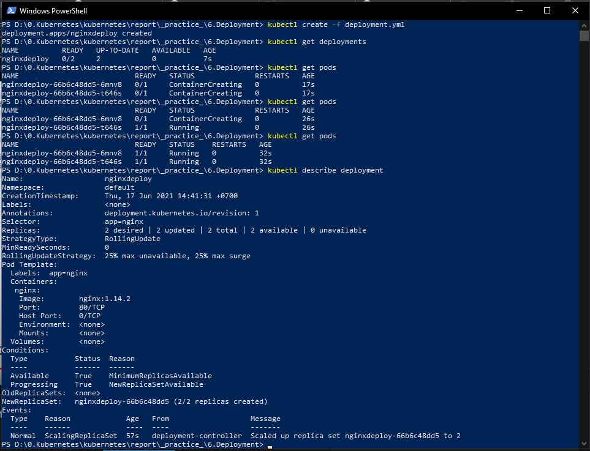
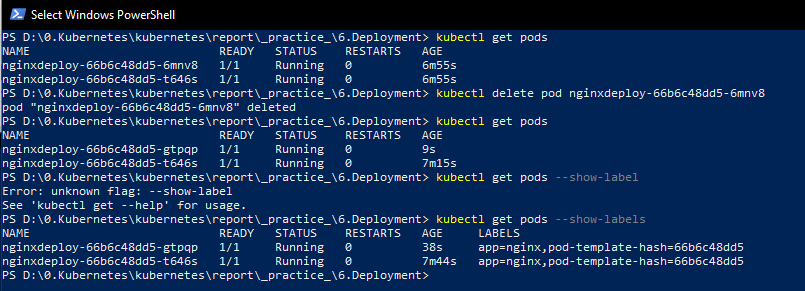
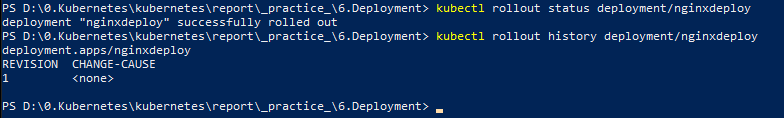

# Deployment
Deployment quản lý một nhóm các Pod - các Pod được nhân bản, nó tự động thay thế các Pod bị lỗi, không phản hồi bằng pod mới nó tạo ra. Như vậy, deployment đảm bảo ứng dụng của bạn có một (hay nhiều) Pod để phục vụ các yêu cầu.

Deployment sử dụng mẫu Pod (Pod template - chứa định nghĩa / thiết lập về Pod) để tạo các Pod (các nhân bản replica), khi template này thay đổi, các Pod mới sẽ được tạo để thay thế Pod cũ ngay lập tức.

[Deployment](https://kubernetes.io/docs/concepts/workloads/controllers/deployment/) cung cấp các bản cập nhật khai báo cho Pods và ReplicaSets. Ta mô tả một desired state trong Deployment và Deployment Controller thay đổi actual state thành desired state mà mình mong muốn với tốc độ kiểm soát được. Ta cũng có thể định nghĩa các Deployment để tạo các ReplicaSets mới hoặc để xóa các Deployment hiện có và sử dụng tất cả các tài nguyên của chúng cho Deployment mới.

Dưới đây là các trường hợp sử dụng điển hình cho Deployment:

  - [Tạo Deployment để rollout một ReplicaSet](https://kubernetes.io/docs/concepts/workloads/controllers/deployment/#creating-a-deployment): 
 ReplicaSet tạo các Pods trong background, ta có thể kiểm tra trạng thái rollout để xem liệu nó có thành công hay không.

  - [Khai báo new state của Pods bằng cách cập nhật PodTemplateSpec của Deployment](https://kubernetes.io/docs/concepts/workloads/controllers/deployment/#updating-a-deployment):
  Một ReplicaSet mới được tạo và Deployment quản lý việc di chuyển các Pod từ ReplicaSet cũ sang ReplicaSet mới với tốc độ kiểm soát được. Mỗi ReplicaSet mới sẽ cập nhật lại bản sửa đổi của Deployment.

  - [Quay lại phiên bản Deployment trước đó nếu trạng thái hiện tại của Deployment không ổn định](https://kubernetes.io/docs/concepts/workloads/controllers/deployment/#rolling-back-a-deployment): 

   - [Mở rộng quy mô Triển khai để tạo điều kiện tải nhiều hơn](https://kubernetes.io/docs/concepts/workloads/controllers/deployment/#scaling-a-deployment)
   
   - [Tạm dừng Deployment](https://kubernetes.io/docs/concepts/workloads/controllers/deployment/#pausing-and-resuming-a-deployment):
Để áp dụng nhiều bản sửa lỗi cho PodTemplateSpec của nó và sau đó tiếp tục triển khai để bắt đầu một đợt phát hành mới.

  - [Sử dụng status của Deployment](https://kubernetes.io/docs/concepts/workloads/controllers/deployment/#deployment-status) như một indicator cho quá trình rollout nếu bị lỗi
  - [Dọn dẹp các ReplicaSets](https://kubernetes.io/docs/concepts/workloads/controllers/deployment/#clean-up-policy) cũ không cần dùng đến nữa

# Thực hành
Deployments được cấu hình trong tập tin manifest [deployment.yml](deployment.yml)
Trong cấu hình Deplyment có name là `nginxdeploy` này gồm 2 Replicas với selector dựa trên label `nginx`. Mỗi Replicas sẽ có cấu hình dựa trên template của Deployment, cụ thể mỗi replicas có label là `nginx` và chạy Containers từ Image `nginx:1.14.2` trên cổng 80.

Đầu tiên, ta sẽ tạo Deployment bằng câu lệnh quen thuộc `kubectl create -f deployment.yml`, sau đó kiểm tra thông tin của deployment như sau:



Như describe ở trên, deployment đang có Replicas là `2 desired | 2 updated | 2 total | 2 available | 0 unavailable` và Pod Template là

```
Pod Template:
  Labels:  app=nginx
  Containers:
   nginx:
    Image:        nginx:1.14.2
    Port:         80/TCP
    Host Port:    0/TCP
    Environment:  <none>
    Mounts:       <none>
  Volumes:        <none>
```

Cũng tương tự như bài thực hành với ReplicaSet, đang có 2 Pods giờ mình thử delete 1 Pods có name là `nginxdeploy-66b6c48dd5-6mnv8`, kết quả như sau:



Như hình trên, khi Pod `nginxdeploy-66b6c48dd5-6mnv8` được xóa đi thì sẽ có một Pod `nginxdeploy-66b6c48dd5-gtpqp` tương tự như ReplicaSet, và label của Pod mới tạo này cũng sẽ khớp với các Pods trong Deployment do được tạo ra bởi cùng template trong deployment.

Ta có thể kiểm tra trạng thái rollout để xem liệu nó có thành công hay không và history của rollout: `kubectl rollout status deployment/nginxdeploy`



